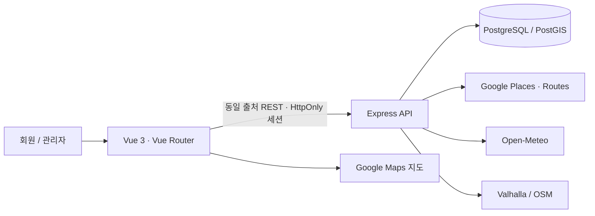

<p align="center"></p>

<h1 align="center">가고 싶은 곳을<br>하나의 여행으로 .</h1>
<p align="center">홋카이도 12개 관광권 · 지도 탐색 · 날짜별 일정 · 근거를 보여주는 추천</p>

<p align="center">
  
  
  
  
  
  <br>
  
  
  
  
  
</p>

## 서비스 소개

Book해도는 소도시의 장소와 일본어 이름을 찾는 불편함, 여행 순서를 지도에 정리하는 어려움, 날씨가 달라졌을 때 일정을 다시 짜는 부담을 줄이는 웹 서비스입니다. 장소를 발견하고, 방문할 날짜에 담고, 지도에서 동선을 비교한 뒤 직접 일정을 확정합니다.

단순히 가고 싶은 곳을 모아두는 목록이 아니라, **“어디를 갈까?”에서 “어떤 순서로 여행할까?”까지 이어주는 홋카이도 전용 여행 플래너**를 지향합니다. 여행 준비 중에는 지역과 취향으로 후보를 좁히고, 여행 중에는 날짜별 지도와 날씨를 보며 계획을 조정할 수 있습니다.

### 이런 여행자를 위해 만들었습니다

- 삿포로 같은 주요 도시뿐 아니라 홋카이도 소도시까지 직접 여행하고 싶은 사람
- 일본어 장소명을 찾고 다시 복사하는 번거로움 없이 한국어로 탐색하고 싶은 사람
- 흩어진 저장 목록을 날짜별 순서와 이동 동선으로 정리하고 싶은 사람
- 비나 눈 때문에 계획을 바꿔야 할 때, 근처 실내 장소나 하루 코스를 비교하고 싶은 사람

### 불편함을 해결하는 방식

| 여행 준비의 불편함 | Book해도의 접근 |
|---|---|
| 유명 도시·장소에 검색이 편중됨 | 12개 관광권의 수집 장소를 지역·키워드·테마로 탐색 |
| 일본어 장소명을 한국어로 찾기 어려움 | 한국어 검색 보조와 제공되는 한국어 상세정보, 현지 검색을 위한 원문 이름 유지 |
| 장소를 저장해도 이동 순서가 잘 보이지 않음 | 날짜별 목록·지도·구간 거리와 시간을 함께 확인 |
| 날씨가 달라지면 일정을 처음부터 다시 고민함 | 기존 동선 주변의 실내 대안·하루 코스를 비교한 뒤 직접 확정 |
| 익숙한 명소 외에 무엇을 볼지 판단하기 어려움 | 일본어 리뷰 표본이 있는 음식점·관광지 후보와 추천 근거 제공 |

일본어 리뷰는 새로운 후보를 발견하는 단서로 활용합니다. 작성자의 거주지·국적을 확인하거나 특정 장소를 “현지인 맛집”으로 인증하는 기능은 아닙니다.

## 주요 기능

| 화면 | 사용자가 할 수 있는 일 |
|---|---|
| 회원가입·로그인 | 계정 생성, 세션 인증, 로그아웃 및 만료 시 재로그인 |
| 발견하기 | 지역 소개 → 테마 선택 → 지도와 연결된 장소 목록 |
| 통합 검색 | `삿포로 공원`, `오타루 빈티지 옷가게`, 장소명 검색 |
| 장소 상세 | 원문 이름, 출처, 확인된 웹사이트, Google 사진·전체 평점·리뷰 |
| 나의 여행 | 여행 생성·이름 수정·삭제, 날짜별 일정과 메모 관리 |
| 여행 일정 | 순서 편집, 교통수단별 경로·거리·시간, 날짜의 날씨 |
| 대안 추천 | 실내 대체 장소 또는 하루 전체 코스 비교 → 미리보기 → 확정/취소 |
| 관리자 | 회원 검색, 권한·이용 상태 변경, 변경 이력 조회 |

## 사용자 이용 흐름

**1. 지역에서 시작하기** — 지역 소개 카드를 살펴보고 마음에 드는 여행 장면을 고릅니다. 지도는 옆에 유지되며 검색 결과 목록과 같은 장소를 표시합니다. `삿포로 공원`, `오타루 빈티지`처럼 지역과 방문 목적을 함께 입력할 수 있습니다.

**2. 근거를 보고 담기** — 장소 상세에서 원문 이름·출처·제공되는 사진과 리뷰를 확인하고 여행과 날짜를 선택해 담습니다. 장소를 추가한 뒤에는 계속 탐색하거나 일정 화면으로 이동할 수 있습니다. 확인된 공식 웹사이트가 없으면 링크를 만들어내지 않습니다.

**3. 날짜별로 연결하기** — 일정 화면에서 장소의 순서를 바꾸고 메모를 남기며 구간별 거리·시간을 확인합니다. 경로를 가져오지 못한 경우에는 실제 도로 경로와 직선거리 안내를 구분하고, 제공되지 않은 이동시간을 임의로 채우지 않습니다.

**4. 계획이 바뀌어도 이어가기** — 날씨가 좋든 나쁘든 하루 코스 추천을 열어 날씨 맞춤·실내 중심·가까운 곳 중심 안을 비교할 수 있습니다. 미리보기만으로는 일정이 바뀌지 않으며, 사용자가 확정할 때만 저장합니다.

## 추천 기능 안내

### 날씨가 달라져도 여행을 이어가도록

비나 눈이 예보되면 기존 장소 주변의 실내 대안을 살펴볼 수 있습니다. 날씨가 좋은 날에도 **날씨 맞춤·실내 중심·가까운 곳 중심**의 하루 코스를 비교할 수 있어, 계획을 새롭게 짜고 싶을 때 활용할 수 있습니다. 기존 일정과 변경안을 확인한 후 사용자가 확정하며, 취소하면 원래 일정이 유지됩니다.

### 일본어 리뷰를 새로운 발견의 단서로

음식점과 관광지 중 **최대 10개 장소 후보**를 확인하고, Google 전체 평점·리뷰 수와 일본어 원문 표본을 함께 보여줍니다. 이름만 보고 고르기 어려웠던 장소를 비교할 수 있도록 추천 근거를 제시합니다. 조건에 맞는 장소가 적으면 결과도 10개보다 적을 수 있으며, 현지인이 작성한 리뷰인지 여부를 단정하지 않습니다.

### 확인되지 않은 정보는 구분해서

공식 웹사이트가 없으면 링크를 만들지 않고, 날씨나 경로를 가져오지 못하면 미제공 상태를 안내합니다. 실제 영업시간·휴무·이동 안전은 방문 전에 다시 확인해야 합니다.

## 시스템 구조

Vue 3 + Express REST API + PostgreSQL/PostGIS로 구성했습니다. AI/LLM·Vector DB를 사용하지 않으며, 추천은 장소 태그·날씨·거리·리뷰 표본과 공개된 계산 기준으로 설명합니다.

화면은 사용자의 탐색과 일정 편집을 담당하고, 서버는 인증·검색·저장·추천을 처리합니다. 장소와 일정은 PostgreSQL/PostGIS에서 관리하며, 지도·날씨·경로 등 외부 정보는 역할에 맞는 제공자와 연결합니다.



## 기술 스택

[](https://github.com/cres17/bookhaedo/actions/workflows/ci.yml)

<p align="center">
  
  
  
  
  
</p>
<p align="center">
  
  
  
  
  
</p>
<p align="center">
  
  
  
</p>

| 계층 | 사용 기술 | 역할 |
|---|---|---|
| Frontend | Vue 3, Vue Router, TypeScript, Vite | 화면·폼·지도 상태와 사용자 흐름 |
| Backend | Node.js 22+, Express 5, Zod, pg | REST, 입력 검증, 소유권, 트랜잭션 |
| Database | PostgreSQL 17, PostGIS | 공간 검색, 수집 장소, 여행, 세션, 감사 이력 |
| Authentication | HttpOnly·SameSite 쿠키, scrypt, 세션 토큰 해시 | 비밀번호·세션 보호 |
| External | Google Maps/Places/Routes, Open-Meteo, Valhalla | 지도·장소 보강·날씨·경로 |
| Quality | Vitest, Supertest, Playwright, ESLint, Prettier | 회귀·정적 검사·브라우저 검증 |
| Contract | OpenAPI 3.1, Swagger UI, DBML | API·데이터 모델 설명 |
| Automation | GitHub Actions, Docker Compose | CI, 로컬 PostGIS |

Google Maps는 지도 표시, Valhalla는 자동차·택시·도보·자전거 경로, Google Routes는 대중교통과 선택적 자동차 교통비 조회에 사용합니다. 경로 조회가 실패하면 직선거리와 `durationSeconds: null`을 반환합니다.

## API와 데이터 모델

- [OpenAPI YAML](docs/Bookhaedo-API.yml) · [OpenAPI JSON](docs/openapi-rest.json)
- [DBML — dbdiagram 편집기에 붙여넣기](docs/erd.dbml)
- [운영·마이그레이션·오류 대응](docs/operations.md)

API 명세의 원본은 `scripts/write-api-spec.mjs`입니다. API 변경 후 `npm run spec:generate`로 JSON·YAML·Swagger 문서를 함께 생성합니다. `npm run spec:check`는 생성물의 일치와 DBML 문법을 확인합니다.

## 프로젝트 구조

```text
frontend/src/    화면, 지도, 추천 패널, 공통 API 클라이언트
server/          인증·검색·일정·추천·외부 제공자 처리
shared/          화면과 서버가 공유하는 날씨 정책
db/              장소·일정·관리자 SQL
tests/           단위·DB·동시성·브라우저 테스트
scripts/         데이터 적재, DB 초기화, 명세 생성
docs/            현재 명세·데이터 출처·운영 및 검증 기록
.github/         자동 품질 검사
```

## 데이터 보호와 안정성

- **일정 충돌 보호**: 날짜별 `revision`을 사용합니다. 오래된 전체 일정·메모·대안 저장은 409로 거절하고 기존 데이터를 보존합니다. 버전 누락은 428입니다.
- **원자적 장소 추가**: 한 장소를 POST로 추가합니다. 이전 화면의 목록으로 다른 탭의 추가 장소를 덮어쓰지 않습니다.
- **전환 중 저장 보호**: 여행 조회 중에는 담기를 막고, 날짜·여행·일정 버전 변경 시 이전 미리보기를 무효화합니다.
- **검색어 보존**: `스스키노`를 스키장 검색으로 잘라내지 않습니다. 결과가 없으면 Google 이름 검색으로 기존 카탈로그의 동일 장소를 찾습니다.
- **공통 날씨 정책**: 발견하기와 일정 대안이 같은 강수·적설·풍속 기준과 실내 근거를 사용합니다.
- **독립적 화면 갱신**: 날씨는 경로 완료를 기다리지 않습니다. DB 저장 완료와 외부 경로 계산 상태를 분리합니다.
- **조회와 저장 한도 분리**: 날씨·경로·대안의 외부 조회 한도는 회원별로 적용합니다. 조회 한도에 도달해도 이미 비교한 일정의 확정을 막지 않습니다.
- **검증·운영 기반**: ESLint, TypeScript, Prettier, DB 회귀 테스트, Chrome E2E, 명세 일치 검사, GitHub Actions CI, 요청 ID, 종료 처리와 운영 설정 검사를 포함합니다.

회원 전용 화면과 관리자 화면은 프론트 라우트뿐 아니라 서버에서 인증·역할·여행 소유권을 확인합니다.

## 추천 판단 기준

### 날씨와 하루 코스

날씨는 Open-Meteo의 일본 시간 기준 오늘부터 10일 예보입니다. 비·눈·이슬비·뇌우, 강수량 5mm 이상, 적설량 1cm 이상, 강수확률 70% 이상, 풍속 40km/h 이상 중 하나면 실내 중심 후보를 제시합니다. 이는 서비스 추천 기준이며 공식 기상특보 기준은 아닙니다.

하루 전체 추천은 날씨와 관계없이 사용할 수 있습니다. 기존 일정 중심에서 직선 20km 이내 후보를 찾아 **날씨 맞춤 / 실내 중심 / 가까운 곳 중심** 코스를 구성합니다. 사용자는 방문 장소 수를 3~6곳으로 선택합니다. 후보가 부족하면 가능한 수만 반환하며 최소 2곳이 필요합니다. 예보가 없으면 예보 미제공을 표시하고 거리·장소 특성으로 구성합니다.

미리보기는 DB를 바꾸지 않습니다. 확정 시 기존 버전을 확인하고 원자적으로 교체합니다. 교체에서 제외된 장소의 메모는 사라지므로 화면에서 이를 안내합니다. 실제 운영기간·휴무·안전·최적 동선을 보장하지 않습니다.

### 일본어 리뷰 단서

음식점과 관광지를 함께 고려해 **최대 10개 장소 후보**를 검사합니다. 외부 요청은 최대 2개씩 처리하며 12초 조회 예산을 둡니다. 장소당 Google이 제공하는 최대 5개 리뷰 표본에서 일본어 원문을 확인합니다.

10개는 검사를 시도할 장소 수의 상한이며, 장소당 리뷰 수나 결과 10개를 보장하는 값이 아닙니다. 후보 부족·조회 시간 초과·품질 기준 미달이면 추천 결과가 적을 수 있습니다. 음식점과 관광지 후보가 충분하면 두 분류를 번갈아 선택하고, 한 분류만 있으면 해당 분류에서 최대 10곳을 확인합니다.

추천 조건은 전체 평점 3.5 이상, 전체 리뷰 5개 이상, 일본어 원문 표본 존재, Google에서 폐업 상태로 표시되지 않는 것입니다. 정렬 점수는 다음과 같습니다.

```text
점수 = (Google 전체 평점 × 전체 리뷰 수 + 3.5 × 20) / (전체 리뷰 수 + 20)
```

전체 Google 평점에 리뷰 수를 반영한 값이며 **일본어 리뷰만의 평점이나 현지인 점수가 아닙니다.** 결과 없음과 외부 서비스 실패를 구분합니다. 리뷰 원문·사진 응답은 서비스 DB에 영구 저장하지 않습니다.

## 로컬 실행

Node.js 22.13 이상인 22.x 또는 24.x/26.x 이상과 Docker가 필요합니다. CI 기준은 Node.js 22입니다. 실제 장소 카탈로그 데이터는 저장소에 포함하지 않습니다.

```bash
npm ci
cp .env.example .env
npm run db:up
npm run db:init
npm run dev
```

`.env`에 지도 키를 입력합니다. 개발 환경은 기존 브라우저 키를 서버에도 사용할 수 있으나 운영 환경은 별도 서버 키가 필수입니다. 키 자체는 커밋하지 않습니다.

- 앱: <http://127.0.0.1:5173>
- Swagger: <http://127.0.0.1:5173/swagger.html>
- 상태 확인: <http://127.0.0.1:3001/api/health>

빈 DB에서는 장소가 표시되지 않습니다. [데이터 소스](docs/data-sources.md)와 [데이터 적재 기록](docs/data-import-report.md)을 확인하고, 다운로드한 CSV·OSM PBF를 준비합니다. 데이터 도구는 `npm run data:setup`으로 설치하고 각 스크립트의 `--help`에서 파일 경로 옵션을 확인할 수 있습니다.

```bash
npm run data:prepare -- --help
npm run data:load -- --help
```

관리자는 가입한 계정을 운영자가 명시적으로 지정합니다. 기본 관리자 비밀번호나 자동 승격 계정은 없습니다.

```bash
npx tsx scripts/grant-admin.ts <가입한-이메일>
```

## 검증

```bash
npm run lint
npm run typecheck
npm run format:check
npm test
npm run spec:check
npm run build
npm run test:e2e
```

`npm test`의 기존 통합 테스트는 홋카이도 카탈로그가 적재된 로컬 DB를 사용합니다. `npm run test:ci`는 외부 키 없이 실행하는 단위 테스트와 자체 임시 데이터를 사용하는 동시성 테스트입니다. CI는 별도 PostGIS 서비스에서 이 검증을 실행합니다.

Chrome E2E에는 실제 Google·Valhalla·Open-Meteo 연결 테스트가 포함되어 외부 설정과 사용량이 필요합니다. macOS는 설치된 Chrome을 사용하며, Linux에서는 `npx playwright install --with-deps chromium`으로 브라우저를 준비합니다. 회귀 테스트는 임시 계정만 만들고 완료 후 정리합니다.

[최신 검증 기록](docs/quality-v2.md)에서 테스트 결과와 외부 연동 범위를 확인할 수 있습니다.

## 운영 범위와 데이터

이 저장소는 운영을 위한 코드 보호 장치와 검증 기반을 갖춘 프로젝트입니다. 다중 인스턴스 부하 시험, 관리자 SSO/MFA, 중앙 관측·알람, 백업 복구 훈련까지 검증한 상용 운영 체계를 의미하지는 않습니다. 실제 배포 조건과 남은 작업은 [운영 안내](docs/operations.md)에 명시했습니다.

기본 장소는 OpenStreetMap·홋카이도 공공 지리 데이터입니다. 화면에 원문 이름·수집 출처·제공되지 않은 정보를 구분해서 표시합니다. 외부 이름 검색은 기존 DB 장소와 이름·150m 위치가 일치할 때만 연결하며, 가상 장소나 링크를 만들지 않습니다.

© OpenStreetMap contributors. 각 데이터와 외부 API의 라이선스·표시 의무를 확인해야 합니다. 원본 CSV/PBF, 비밀키, 사용자 DB 덤프와 개인 발표 자료는 소스 배포에 포함하지 않습니다. Rakuten·Hot Pepper API는 현재 실행 경로에 연결되어 있지 않습니다.
