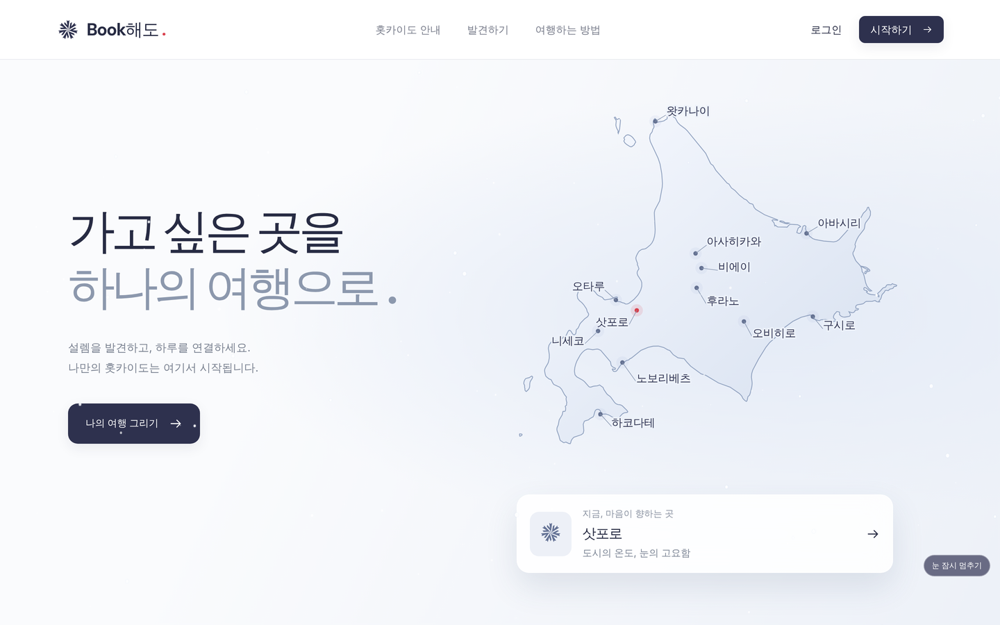
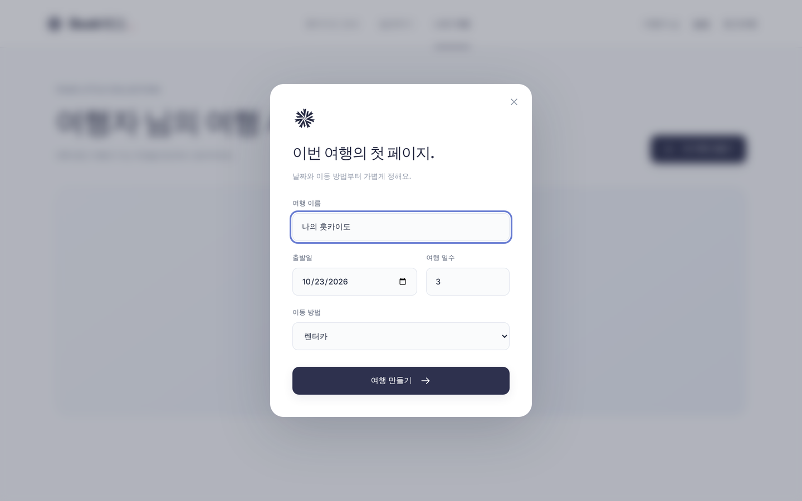
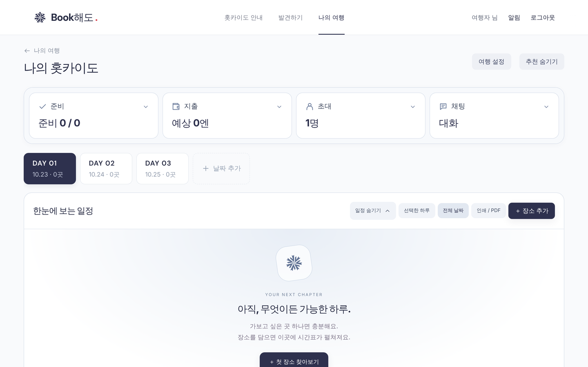
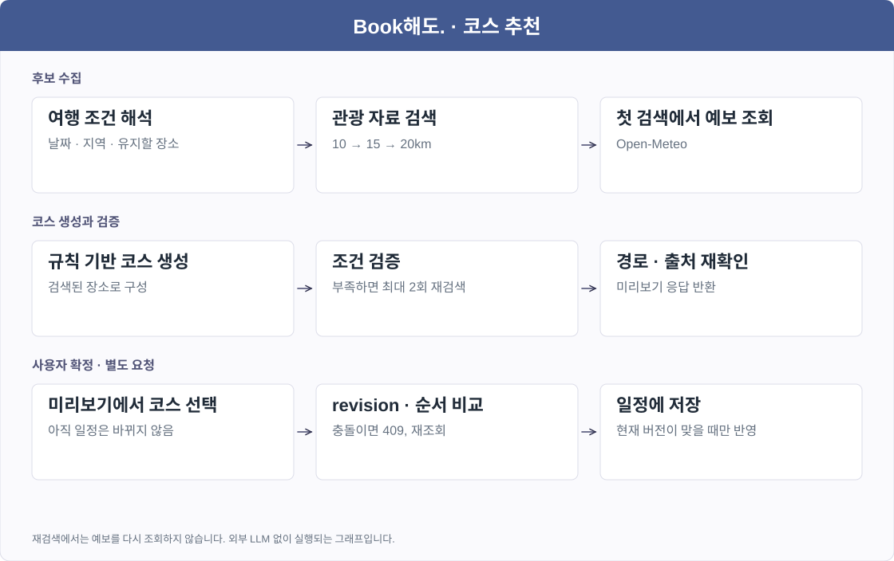

<p align="center">
  
</p>

<h1 align="center">Book해도.</h1>

<div align="center">


</div>

홋카이도 여행 일정을 동행자와 함께 만드는 웹 서비스입니다. 12개 관광권의 장소를 지도에서 찾고 날짜별로 배치하며, 메모와 경비를 함께 관리합니다. 여행일의 날씨가 좋지 않으면 실내 대안이나 다른 하루 코스를 확인할 수 있습니다.

[화면](#화면) · [구조](#구조) · [코스 추천](#코스-추천) · [일정 저장](#일정-저장) · [데이터](#데이터) · [실행](#실행)

## 화면

| 첫 화면 | 여행 만들기 | 플래너 |
|:---:|:---:|:---:|
|  |  |  |

장소 데이터를 적재하기 전의 로컬 화면입니다. 카탈로그를 넣으면 지도와 플래너에서 장소를 검색할 수 있습니다.

## 구조


Vue 화면은 같은 출처의 `/api`를 호출합니다. Express가 세션과 여행 접근 권한을 확인하고, PostgreSQL에 일정과 협업 데이터를 저장합니다. 로그인은 HttpOnly 쿠키로 유지하며 DB에는 세션 토큰의 해시를 보관합니다.

장소와 여행 데이터는 한 DB 안에서 스키마를 나눴습니다.

| 스키마 | 저장하는 데이터 |
|---|---|
| `geo_data` | OSM 장소 카탈로그와 PostGIS 좌표 |
| `planner` | 사용자, 세션, 여행, 일정, 동행자, 요청 제한 카운터 |
| `tourism_knowledge` | 공개 관광 자료, 출처, 발행 snapshot, 철회 기록 |

지도는 Google Maps를 사용합니다. 장소 상세와 리뷰는 Places, 대중교통 경로는 Routes에서 가져옵니다. 도보·차량·자전거 경로는 Valhalla로 계산하고, 날씨는 Open-Meteo에서 조회합니다.

## 코스 추천



`server/ai/tourism-graph.ts`의 LangGraph가 검색과 검증 순서를 관리합니다. 현재 코스 생성은 규칙 기반이며 외부 LLM이나 임베딩 모델은 연결되어 있지 않습니다.

1. 일정의 지역, 날짜, 유지할 장소와 관심 주제를 정리합니다.
2. 장소 카탈로그와 공개 관광 자료에서 후보를 찾습니다. 결과가 부족하면 반경을 10km에서 15km, 20km까지 넓힙니다.
3. 첫 검색에서 예보를 조회하고 코스를 구성합니다. 재검색은 최대 두 번이며 이때 예보를 반복 조회하지 않습니다.
4. 유지 조건을 검증하고 선택한 코스의 이동 경로를 조회합니다.
5. 응답 전에 출처 권리, snapshot, 적용 기간과 철회 여부를 다시 확인합니다.

추천 응답에는 장소와 이동 경로뿐 아니라 사용한 자료의 출처가 포함됩니다. 조회 중 자료가 철회되었거나 바뀌었을 가능성이 있어, 최초 검색 결과만 믿지 않고 반환 직전에 다시 검사합니다.

### 날씨에 따른 실내 대안

야외 장소의 여행일 예보에 비·눈·이슬비·뇌우가 있거나, 아래 값 중 하나를 넘으면 20km 안의 실내 장소를 찾습니다.

| 항목 | 대안을 찾는 기준 |
|---|---:|
| 강수량 | 5mm 이상 |
| 적설 | 1cm 이상 |
| 강수확률 | 70% 이상 |
| 풍속 | 40km/h 이상 |

이는 서비스의 추천 기준입니다. 예보가 없으면 `NO_FORECAST`, 날씨 조건에 해당하지 않으면 `FAIR_WEATHER`, 야외 장소가 아니면 `NOT_OUTDOOR`를 반환합니다. 후보를 선택하면 앞뒤 장소와의 경로를 먼저 확인할 수 있습니다.

## 일정 저장

추천을 받는 동안 동행자가 같은 일정을 고칠 수 있습니다. 따라서 추천 조회와 일정 변경을 별도 요청으로 나누고, 저장할 때 조회 당시의 버전을 확인합니다.

쓰기 요청에는 `expectedRevision`이 필요합니다. 서버는 날짜 행을 잠근 뒤 현재 revision과 장소 순서를 대조합니다. 값이 없으면 `428 REVISION_REQUIRED`, 버전이 달라졌으면 `409 STALE_ITINERARY`를 반환합니다. 이동 수단 등 추천 조건이 바뀐 경우도 `409 RECOMMENDATION_CONTEXT_CHANGED`로 거절합니다.

예를 들어 revision 7에서 받은 추천을 확인하는 동안 동행자가 일정을 수정해 revision 8이 되었다면, 이전 추천으로 덮어쓰지 않습니다. 사용자가 변경된 일정을 다시 읽고 선택해야 합니다.

확정 요청 뒤 응답을 받지 못한 경우에는 저장 여부를 단정하지 않습니다. 화면이 결과 불명 상태를 sessionStorage에 남기고 현재 일정을 다시 조회해 확인하도록 합니다. 관련 코드는 `itinerary-version.ts`, `itinerary-write.ts`, `recommendation-recovery.ts`에 있습니다.

## 데이터

### 장소 카탈로그

`prepare_hokkaido_data.py`가 OSM 추출본에서 관광지·음식점 등 POI를 추출하고 geometry를 정리합니다. `load_postgis.py`가 이를 `geo_data`에 넣습니다. 장소 카탈로그와 추천의 근거 자료는 별도로 적재합니다.

### 공개 관광 자료

`scripts/tourism/collector.py`는 승인된 출처만 수집하고 원본 SHA-256과 수집 이력을 남깁니다. `normalize.py`가 인코딩, 필수 열, 날짜와 좌표를 검사하면 `publish.ts`가 새 snapshot을 트랜잭션으로 발행합니다. 자료 철회는 `withdraw.ts`에서 처리합니다.

수집·정제·발행을 분리해 일부 자료가 실패했을 때 불완전한 버전이 공개되지 않도록 했습니다. 실행 방법과 자료별 조건은 [관광 자료 문서](docs/tourism-langgraph.md)에 있습니다.

## 실행

Node.js `^22.13 || ^24 || >=26`과 Docker가 필요합니다.

```bash
cp .env.example .env
npm install
npm run db:up
npm run db:init
npm run dev
```

PostGIS는 `localhost:5433`, API는 `3001`, Vite는 `5173`을 사용합니다. `.env`의 브라우저 지도 키를 먼저 입력합니다.

| 환경변수 | 설정 |
|---|---|
| `DATABASE_URL` | PostgreSQL 접속 주소 |
| `VITE_GOOGLE_MAPS_API_KEY` | 브라우저의 Google Maps 키 |
| `GOOGLE_MAPS_SERVER_API_KEY` | 서버용 키. 운영에서는 브라우저용 키와 분리 |
| `APP_ORIGINS` | 허용할 출처 목록 |
| `VALHALLA_BASE_URL` | 도보·차량·자전거 경로 서버 주소 |
| `METRICS_TOKEN` | 운영 지표 조회용 토큰, 32자 이상 |

장소 카탈로그를 적재하려면 저장소 루트에 `hokkaido-*.osm.pbf`와 `Hokkaido_OD_GeoDataBase.csv`를 준비합니다. 기본 OSM 파일명은 `hokkaido-260907.osm.pbf`입니다.

```bash
npm run data:setup
npm run data:prepare
npm run data:load
```

자체 Valhalla는 아래 명령으로 실행하고 `VALHALLA_BASE_URL=http://127.0.0.1:8002`를 지정합니다. 운영 시에는 자체 서버나 사용 권한이 있는 엔드포인트를 사용합니다.

```bash
docker compose -f docker-compose.valhalla.yml up -d
```

## 테스트와 운영

```bash
npm run lint
npm run typecheck
npm run spec:check
npm run test:ci
npm run test:e2e
```

Vitest와 Supertest는 도메인 규칙, 권한, API 계약, 동시 수정과 추천 그래프를 검사합니다. PostgreSQL이 필요합니다. Playwright는 데스크톱·모바일에서 추천 확정, 저장 복구와 초대를 확인합니다.

CI는 PostGIS 서비스와 함께 마이그레이션, 테스트, 수집기 검사, 부하 기준, OpenAPI·DBML 정합성 및 빌드를 수행합니다. 백업과 복원 훈련은 `operations-drill.yml`에서 따로 실행합니다.

추천 요청의 처리 예산은 15초입니다. 연결이 끊기면 진행 중인 외부 요청에도 취소를 전달합니다. Valhalla의 동시 실행 수와 대기열을 제한하고, Places·Routes·예보 응답에는 TTL 캐시를 둡니다. 요청 제한 카운터는 여러 서버 프로세스가 공유할 수 있도록 PostgreSQL에 저장합니다.

경로별 요청 수, 지연 시간과 중단 수는 `/internal/metrics`에서 확인합니다. API 명세는 [OpenAPI](docs/openapi-rest.json), 데이터 모델은 [DBML](docs/erd.dbml)에 있습니다.
