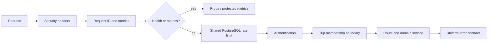

# Book해도 아키텍처 경계

## 서버

`server/app.ts`는 HTTP 조립부다. 보안 헤더, 요청 문맥, 관측, 상태 확인, 중앙 요청 제한, 인증·여행 접근 경계를 정해진 순서로 연결한다. 비즈니스 SQL을 넣지 않는다.

- `server/http`: 전송 계층 공통 정책. 오류 계약, Origin/CSP, PostgreSQL 기반 요청 제한을 담당한다.
- `server/observability`: 본문·쿠키·쿼리 값을 수집하지 않는 구조화 로그와 낮은 cardinality 지표를 담당한다.
- `server/auth`: 비밀번호, 세션, 여행 단위 접근을 담당한다.
- `server/routes`: 입력 검증과 HTTP 응답을 조립한다. 여행 하위 라우트는 app의 인증·멤버십 검사를 지난 뒤 실행된다.
- 도메인 서비스 파일: 추천, 경로, 대안, 정산처럼 HTTP와 분리해 단위 검사할 수 있는 계산과 제공자 연결을 담당한다.
- `server/db.ts`, `migrations.ts`, `transactions.ts`: 연결 수명, 스키마 버전, rollback 실패 처리를 담당한다.

요청 순서는 다음과 같다.

## 프런트엔드

`main.ts`는 앱 부팅만 하고 라우트 정의·가드는 `router.ts`가 소유한다. 화면은 사용자 흐름을 조립하고, 재사용 가능한 표시와 상호작용은 `components/`, 비동기 상태·폴링·수명 관리는 `composables/`에 둔다.

- `useTripTools`: 체크리스트·정산 요약·동행자·초대·채팅의 갱신과 mutation을 캡슐화한다. `TripTools.vue`는 탭과 패널을 표시한다.
- `useTripSynchronization`: 다른 동행자의 revision 변경 감지와 타이머 정리를 캡슐화한다.
- `api.ts`: 오류 형식과 세션 만료 이벤트를 한 곳에서 처리한다.
- `store.ts`: 로그인 사용자와 현재 여행처럼 앱 전역에서 실제 공유되는 상태만 가진다.

새 기능은 화면에 직접 타이머나 인증 정책을 추가하지 않고 기존 경계에 연결한다. 새 여행 하위 API는 app의 `/api/trips/:id` 경계 아래에 두며, 소유자 전용 변경은 라우트에서 `res.locals.trip.isOwner`를 추가 검사한다.
