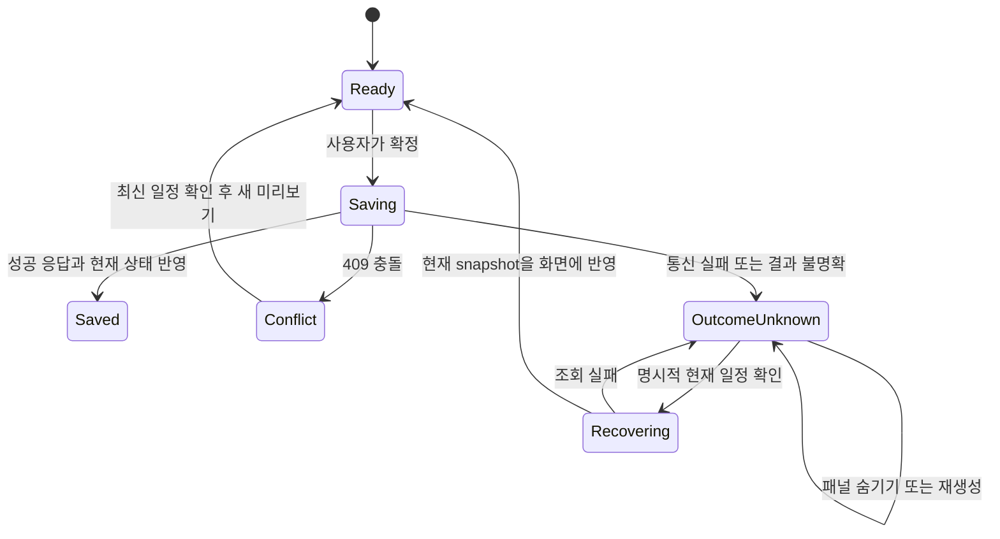

# Book해도 — Drift Gate 실사용 검증과 후속 코드 리뷰

검증일: 2026-10-06 (한국 시간)

**현재 변경은 Drift Gate와 기존 전체 테스트를 통과한다. 그러나 추가 반례에서 저장 결과 복구 상태의 수명 문제와 OpenAPI 오류 응답 누락을 재현했다. 따라서 ‘모든 테스트가 통과했으므로 추가 보완이 없다’는 결론은 채택하지 않는다.**

이 문서는 사용자가 개발한 Drift Gate를 실제 Book해도 변경에 적용하고, 도구의 판정과 코드의 실행 결과를 대조한 기록이다. 운영 코드를 새로 수정하거나 배포한 작업은 아니다. AI 제안 검증 사례는 실제 과거 구현과 이번 재현에 근거하며, 사람이 하지 않은 실험이나 결정을 사람의 경험으로 꾸미지 않는다.

## 1. 고정한 대상과 검증 범위

| 대상 | 기준 |
|---|---|
| Book해도 현재 결과물 | [`454a870`](https://github.com/cres17/bookhaedo/commit/454a8707078d46d50db978df3ce539b9b0fa775c) |
| 변경 비교 기준 | `3fa83a1cb386ca721ac2528b6401cf70592c8684` → `454a870`, 38개 파일 |
| 사용한 Drift Gate | [`ver2@01e28e1`](https://github.com/cres17/pr-convention-checker/tree/01e28e1620941a539d3e9c14972201b30adafd3b), 실행 당시 원격 SHA와 일치 |
| 실행 형태 | 소스 CLI, Python 3.11 독립 가상환경, 선택적 LLM 비활성 |
| 정책 | 이번 평가에서 작성한 [review-policy.yml](drift-gate-validation-20261006/review-policy.yml) |
| 기존 CI | [37410713995](https://github.com/cres17/bookhaedo/actions/runs/37410713995), 해당 SHA에서 verify·tourism-e2e 성공 재확인 |
| 직접 재실행 | 전체 Vitest·전체 E2E·일회용 DB의 CI 묶음·Python·정적 검사·빌드 |
| 추가 진단 | 문서/테스트 제거 대조군, 과거 provider 코드 대조군, 과거 URL 정책 비교, 실제 HTTP 잠금 충돌, 두 화면 폭의 복구 상태 소실 |

38개 파일 변경과 연결된 조회·확정·권한·경로·지도·복구 흐름을 중심으로 검토했다. 저장소 전체의 모든 실행 경로나 실제 운영 장애를 완전히 검증한 보안 감사는 아니다. 과거 전체 리뷰와 이번 검증을 혼동하지 않도록 원본 리뷰 파일은 유지했다.

Book해도 작업 트리의 추적된 운영 파일은 변경하지 않았다. Drift Gate 저장소에 이미 있던 문서 삭제 두 건도 그대로 두었다. 임시 복제본에서만 코드 되돌림·문서 제거·진단 파일 추가를 수행했고, 경계 진단과 CI 묶음에 사용한 일회용 DB는 제거했다.

## 2. Drift Gate를 실제 적용한 결과

처음에는 Book해도에 `.drift-gate.yml`이 없었다. 실제 CLI 결과는 `PASS`, 종료 코드 0이었지만 **평가한 규칙은 0개**였다. Markdown에는 정책이 없다는 설명이 있었고 JSON에는 `no_policy` 필드가 없었다. 이 첫 결과를 검증 성공으로 받아들이지 않고 정책을 구성했다.

정책은 API 문서 3개, 쓰기/조회 계약과 DB 회귀 검사, provider 경계와 검증 테스트, 저장 복구와 E2E, SQL/ERD, CI 범위, 출처 정책의 동반 변경을 요구한다. 이번 변경에서는 7개 중 5개가 발동해 통과했고 SQL 스키마·출처 정책의 2개는 변경이 없어 발동하지 않았다. `evaluated_rules=7`을 ‘7가지 동작 모두 검증’으로 해석하면 안 된다.

이번 정책의 `content: paths`는 파일의 동반 수정 여부를 검사한다. 오류 응답의 의미, SQL 격리 수준, UI 상태 전이를 증명하는 정책이 아니다. 현재 변경에 맞춰 사후 작성한 정책이므로 독립적인 일반화 성능 평가나 기존 CI 적용 실적으로 소개하지 않는다.

| 입력 | Drift Gate | 별도 실행 | 해석 |
|---|---|---|---|
| 정책 없음 | PASS / exit 0 / 규칙 0개 | Markdown에 미설정 안내 | 유효한 검증 통과로 인정하지 않음 |
| 현재 38개 파일 변경 | PASS / exit 0 | 5개 발동 규칙 충족 | 지정한 문서·검증 파일 동반 변경 확인 |
| OpenAPI 3개만 이전 상태로 복원 | FAIL / exit 1 | `api-contract` 위반 | 필요한 API 문서 누락 차단 확인 |
| 새 저장 복구 E2E만 제거 | FAIL / exit 1 | `recommendation-recovery` 위반 | 지정한 검증 파일 누락 차단 확인 |
| 문서·테스트는 유지하고 provider 연결 코드 2개만 이전 상태로 복원 | PASS / exit 0 | 경로 응답 테스트 **9개 실패·32개 통과** | 문서 동반 변경만으로 동작 회귀를 탐지할 수 없음 |

대조군에는 실제 `server/routing.ts`와 `server/providers.ts`의 이전 코드를 사용했다. 운영 파일을 수정하지 않았으며, 이 대조군은 도구의 한계를 확인하기 위한 의도적인 회귀다. 실제 사용자가 낸 PR이나 미발견 운영 장애라고 소개하면 안 된다.

AST 분석도 제한이 있다. JSON 보고서에서 TypeScript 일부는 `grammar+heuristic`, 불완전 diff 조각은 heuristic으로 표시됐다. Vue SFC·`.mts`·JSON/YAML 등은 해당 실행에서 grammar 기반 분석이 아니었다. 이번 검사는 경로 규칙이 중심이므로 이 사실을 숨길 필요 없이 분석 범위로 기록한다.

원본: [현재 판정](drift-gate-validation-20261006/current.md), [JSON](drift-gate-validation-20261006/current.json), [HTML](drift-gate-validation-20261006/current.html), [대조군 요약](drift-gate-validation-20261006/gate-summary.json), [실패한 동작 테스트](drift-gate-validation-20261006/control-old-provider-tests.log).

## 3. AI 구현을 검증한 뒤 그대로 유지하지 않은 실제 사례

### 사례 A — ‘인코딩 URL 전면 차단’ 구현을 철회·수정

이 대화에서 AI가 구현했던 `c217502`의 `cleanUrl`은 `%`가 들어간 URL을 모두 거절했다. URL 우회 방어를 강화하는 방식이었지만, 기존 수집 기록에 있는 후라노 CSV 두 개의 일본어 파일명은 정상적인 퍼센트 인코딩이었다.

이번에는 설명만 재사용하지 않았다. Git에서 **그 커밋의 TypeScript·Python 정책 원문과 당시 정책 설정을 추출**하고, 현재 버전과 같은 31개 URL 입력으로 실행했다. 자료를 새로 다운로드한 실험은 아니다. 원문 URL 두 개는 기존 수집 기록에서 확인되는 입력이며, 나머지에는 경계·공격 fixture가 포함된다.

| 고정 입력 | `c217502` | 현재 `454a870` |
|---|---|---|
| 후라노 시설 CSV의 인코딩된 일본어 파일명 | 거절 | 허용 |
| 후라노 행사 CSV의 인코딩된 일본어 파일명 | 거절 | 허용 |
| 정상 ASCII 파일명 | 허용 | 허용 |
| 31개 전체 입력의 기대값 불일치 | 각 언어 4개 | 각 언어 0개 |
| Python·TypeScript 결과 일치 | 일치 | 일치 |

31개 중 정상 허용 사례는 5개, 거절 사례는 26개다. 이전 버전의 실패 4개는 실제 URL 두 개와 정상 경계 입력 두 개다. 현재 버전은 정상 인코딩 파일명을 허용하면서 구조를 바꾸는 인코딩·이중 인코딩·다른 출처 등의 거절 사례를 유지한다. 고정 31개 입력의 성공을 모든 URL 우회에 대한 보안 증명으로 확대하지 않는다.

**채택하지 않은 내용:** `%` 포함 자체를 악성 또는 승인 범위 밖으로 판단하는 일괄 차단 규칙.

**유지한 원칙:** 승인된 HTTPS 출처·자료 경로 제한, 경로 우회 차단, Python과 TypeScript의 동일한 판정.

정확한 사례 표현은 **‘이미 반영된 AI 구현을 검증 후 수정했다’**다. 해당 코드는 실제로 과거 커밋에 있으므로 ‘처음부터 한 번도 받아들이지 않았다’고 쓰면 사실과 다르다. 원문 코드상 수정 커밋은 `a9b31c8`이며 현재까지 유지된다. AI가 작성했다는 맥락은 이 대화 이력에, 동작의 차이는 저장소와 이번 실행에 근거한다.

근거: [31개 입력](drift-gate-validation-20261006/source-url-cases.json), [두 언어·두 버전 실행 결과](drift-gate-validation-20261006/historical-url-rejection.json), [재현 코드](drift-gate-validation-20261006/run-behavior-controls.py), [현재 정책](../../server/tourism-source-policy.ts), [기존 회귀 검사](../../tests/tourism-source-policy.test.ts).

### 사례 B — AI의 완료 보고를 검증 범위에 맞게 제한

직전 AI 보고에는 저장 결과 불명확 시 재저장 차단·현재 일정 확인, 문서 동기화, 전체 테스트 통과가 포함됐다. 기존 패널 안에서의 복구와 생성 문서 일치는 사실이지만, 이를 **화면 재생성까지 포함한 복구 완료·모든 실제 오류 응답의 문서화 완료**로 확대해서는 안 된다.

이번 추가 검증에서 아래 B1·B2가 재현됐다. 이전 보고 전체를 틀렸다고 버리는 대신, 통과가 확인된 기능은 유지하고 완료 판단의 범위를 좁힌다. 이 과정 자체가 ‘AI의 설명을 근거 없이 신뢰하지 않고 코드·실행 결과로 검증한 사례’다. 사용자 본인이 모든 코드를 직접 읽고 실험했다고 기록하지 않는다.

## 4. 현재 결과물에서 확인한 보완점

### B1 / P2 — 화면 재생성으로 저장 결과 확인 상태가 사라짐

- 코드: [DayAlternatives.vue](../../frontend/src/components/DayAlternatives.vue)의 `outcomeUnknown`은 컴포넌트 내부 `ref(false)`다. [Planner.vue](../../frontend/src/views/Planner.vue)의 `v-if="showRecommendations"`가 컴포넌트를 제거한다.
- 재현: 저장 요청의 전송 실패 → ‘현재 일정 확인’ 버튼 노출 → 패널 닫기 → ‘추천 숨기기’ → ‘하루 코스 추천 켜기’ → 코스 선택.
- 결과: 명시적인 현재 일정 확인을 누르지 않았는데 복구 버튼이 사라지고 저장 버튼이 다시 활성화됐다. **1440px·390px 모두 재현**했다.
- 이번 실험의 한계: 실패는 전송 전 네트워크 fixture다. 두 번째 저장은 하지 않았다. 자동 재전송·중복 COMMIT·데이터 유실을 재현했다는 뜻은 아니다. 기존 revision 검증은 계속 보호 장치로 작동한다.
- 영향: ‘결과를 모르면 먼저 확인한다’는 화면 계약이 패널 수명에 의존한다. 작성된 설계는 unmount 후에도 복구 경로가 있어야 한다고 명시했지만 구현 완료 목록은 이 경우를 놓쳤다.

**수정 방향:** trip/day를 키로 하는 명령 상태를 추천 패널 바깥에 둔다. 같은 화면에서 숨기기·이동수단 변경으로 컴포넌트가 재생성돼도 `OutcomeUnknown`을 복원한다. 라우트 이탈·브라우저 새로고침까지 보장할지 범위를 정하고, 필요하면 사용자 식별과 만료를 포함한 최소 메타데이터만 보존한다. 전체 일정·토큰을 저장할 이유는 없다.

**완료 조건:** 숨기기/다시 켜기, 날짜 전환, 이동수단 전환, 저장 중 화면 이탈을 검사한다. 원래 trip/day와 명령을 기준으로 상태를 복구하고 확인 전 새 저장을 차단한다. 전송 전 실패와 COMMIT 후 응답 유실을 모두 검사하며, 자동 PATCH 횟수는 0이어야 한다. 현재 일정 GET 결과를 부모에 직접 반영해 복구 직후 별도 GET 실패가 끼어드는 흐름도 줄인다. 이는 제안이며 현재 구현된 상태가 아니다.

근거: [브라우저 진단 코드](drift-gate-validation-20261006/browser-probe.spec.ts.fixture), [실행 로그](drift-gate-validation-20261006/browser-probe.log). 이 진단은 결함이 존재함을 확인하므로 ‘2개 통과’를 정상 회귀 검사 통과로 합산하지 않는다.

### B2 / P2 — 실제 409 응답이 OpenAPI 세 작업에 없음

[lockTripForWrite](../../server/trip-write.ts)는 3초 잠금 제한을 적용하고, [오류 미들웨어](../../server/http/middleware.ts)는 `55P03`을 `409 / TRIP_WRITE_BUSY`로 반환한다. 새 잠금에 참여한 다음 세 작업의 OpenAPI `responses`에는 409가 없다.

| 실제 작업 | 잠금 충돌 시 응답 | OpenAPI |
|---|---|---|
| `PATCH /trips/{id}` | 409 / TRIP_WRITE_BUSY | 409 누락 |
| `PATCH /trips/{id}/cost-settings` | 409 / TRIP_WRITE_BUSY | 409 누락 |
| `DELETE /trips/{id}` | 409 / TRIP_WRITE_BUSY | 409 누락 |

일회용 PostgreSQL에서 부모 trip 행을 다른 연결로 잠근 후 실제 HTTP 세 요청을 실행해 모두 확인했다. 서버가 잘못 저장한 문제는 없었다. 문제는 새 클라이언트·SDK·계약 검증 도구가 실제 응답을 명세에서 찾을 수 없다는 점이다.

`spec:check`는 생성기와 생성된 문서의 일치를 확인해 통과한다. **생성기의 누락도 생성본에 똑같이 반영되면 통과한다.** Drift Gate도 세 문서가 함께 바뀌었으므로 통과했다.

**수정 방향:** [명세 생성기](../../scripts/write-api-spec.mjs)의 해당 세 작업에 409와 오류 코드·복구 안내를 추가하고 세 생성본을 다시 만든다. 공통 오류 스키마를 사용하되 각 작업에서 실제 가능한 상태를 선언한다.

**완료 조건:** 실제 HTTP 응답의 상태·코드·필수 필드가 해당 작업 명세에 포함되는지 확인하는 통합 검사 추가. 단순 파일 동등성 검사와 의미 계약 검사를 둘 다 유지한다. 이 진단의 현재 `not.toContain('409')`는 결함 확인용이므로 수정 뒤에는 `toContain('409')`인 별도 회귀 검사로 바꾼다.

근거: [DB/HTTP 진단 코드](drift-gate-validation-20261006/contract-probe.test.ts.fixture), [실행 로그](drift-gate-validation-20261006/contract-probe.log), [현재 OpenAPI](../openapi-rest.json).

### D1 / 필수 CI 도입 전 P2 — Drift Gate의 미설정 결과를 기계가 구별하기 어려움

정책이 없을 때 Core는 `no_policy=True`, `result='pass'`를 만든다. CLI는 fail일 때만 종료 코드 1을 반환한다. JSON 직렬화는 `no_policy`와 `skip_reason`을 내보내지 않는다. Markdown의 안내를 읽는 사람은 구별하지만 `result`만 소비하는 자동화는 검증 성공으로 처리할 수 있다.

이 동작을 임의로 보안 우회라고 단정하지 않는다. 로컬 도입 편의를 위한 동작일 수 있다. 다만 **필수 품질 게이트**로 연결할 때는 계약이 부족하다.

**개선 방향:** JSON에 `evaluation_status` 또는 `no_policy`, `skip`, `skip_reason`을 추가한다. 기존 로컬 동작은 유지하더라도 CI에는 `--require-policy` 같은 엄격 모드를 제공한다. 임시 대안은 정책 존재·유효성 확인과 규칙 발동 수를 확인하는 외부 검사다. `unmatched`, `docs-only`, ‘정책 없음’을 모두 실패 처리하는 단순 구현은 정상 PR도 막으므로 구분해야 한다.

근거: [정책 없는 JSON](drift-gate-validation-20261006/no-policy.json), [안내가 있는 Markdown](drift-gate-validation-20261006/no-policy.md), [Core](https://github.com/cres17/pr-convention-checker/blob/01e28e1620941a539d3e9c14972201b30adafd3b/drift_gate/core/engine.py#L43), [직렬화](https://github.com/cres17/pr-convention-checker/blob/01e28e1620941a539d3e9c14972201b30adafd3b/drift_gate/core/models/result.py#L396).

## 5. 유지할 구현과 후속 개발 우선순위

다음 개선은 이번 재실행에서도 유지할 근거가 있다. 한 SQL로 읽는 trip snapshot, trip→day/item의 쓰기 잠금 순서, 대기 후 현재 멤버 접근 재검사, 유지 항목의 ID·사용자 필드 보존, 공통 시설 중복 정책, provider geometry/크기 검사와 캐시 전 검증, 경로선 부재 시 회색 점선 표시는 현행 회귀 검사와 정합적이다. 이를 다시 크게 교체할 근거는 발견하지 못했다.

| 순서 | 작업 | 이유 | 완료 근거 |
|---|---|---|---|
| 1 | B1 복구 상태를 패널 밖으로 이동 | 재현된 화면 계약 누락 | 화면 재생성·응답 유실의 양성/음성 E2E |
| 2 | B2 409 명세와 실제 응답 계약 검사 | 재현된 문서 누락 | 실제 세 HTTP 응답 대조 + spec:check |
| 3 | Drift Gate 필수 모드와 지속 정책 | 현재는 이 평가에서만 실행 | 정책 없음/잘못된 정책/발동 없음 구분, 누락 대조군 CI 차단 |
| 4 | CI 테스트 포함 방식 정리 | 54개 중 48개만 명시적으로 나열 | 새 테스트 파일의 누락 감지, catalog 의존 파일의 격리 fixture |
| 5 | provider 실패 이유 지표 | 포괄 catch의 동일 fallback으로 원인 구별이 어려움 | timeout/queue-full/invalid-body/invalid-geometry의 고정 enum 및 지표 |
| 6 | 읽기 요청 전체 시간 예산 | 현재 15초 handler 예산보다 앞에 인증·한도·ACL DB 조회 존재 | 해당 구간의 지연 주입과 전체 응답 시간·연결 회수 측정 |
| 7 | 그래프와 HTTP/DB 결합 축소·DTO 명시 | `tourism-graph.ts`가 Express Router를 가진 `day-alternatives.ts`의 helper를 import, 여러 `any` 경계 존재 | 순수 후보/정렬 모듈, typed repository, 동일 입력 결과 보존 |
| 8 | 실제 용량·복원 측정 | fixture 통과와 운영 동시 사용자 처리량은 별개 | 동일 부하 입력, p95/p99·상류 호출 수·대기열·실패율·복원 증거 |

4번에서 현재 CI 목록 밖인 파일은 `admin`, `api`, `collaboration`, `day-alternatives`, `place-search`, `weather-alternatives`의 6개 테스트 파일이다. 이번에는 전체 54개 파일을 직접 실행했다. 현재 CI 묶음의 성공을 전체 파일 실행으로 표현하지 않는다. 새 파일 자동 수집을 도입해도 catalog가 없는 CI에서 실패하는 기존 파일의 의존성을 먼저 해소해야 한다.

5~8번은 정적 구조와 현행 계약에서 도출한 개선 후보다. 이번에 별도의 용량 시험이나 장애 유실을 재현했다고 주장하지 않는다. 특히 AWS 연결, LLM 생성기 연결, 분산 lease, 서버 저장 proposal, idempotency 테이블을 ‘엔터프라이즈’라는 이유만으로 모두 추가할 필요는 없다. 자동 재전송·다중 프로세스 운영·근거 승인 이력 같은 실제 요구가 생기면 그 계약을 먼저 정한다.

## 6. 다음 수정의 설계와 검증 순서

### 저장 명령의 상태 소유권

아래는 **제안 설계**다. 현재 코드의 기능 완료도가 아니다.

상태 키는 최소 `tripId + date`이며 진행 중 요청은 시작 당시의 revision·장소 목록·이동수단을 캡처한다. UI가 다른 날짜로 이동해도 새 props를 과거 명령 결과와 결합하지 않는다. 명령 상태 저장소가 종료 결과를 받고, 패널은 그 상태를 표시한다. GET은 현재 상태 확인일 뿐 과거 PATCH의 정확한 완료 이력 증명은 아니다. 자동 재전송이 요구되면 별도의 operation ID와 서버 결과 보존 계약이 필요하다.

### 문서 게이트와 실행 검증의 역할

정책은 검토 중인 PR에서 임의로 약해져 통과하지 않도록 기준 브랜치의 정책 또는 승인된 정책 변경을 사용한다. 이번 고정 날짜의 `review-policy.yml`을 그대로 모든 PR에 적용하면 과거 보고서 파일을 계속 수정하게 만드는 부작용이 있다. 지속 운영용으로 바꿀 때 API·운영·복구 계약 문서의 안정된 경로를 정하고 적용 제외 사유도 검토 가능하게 남긴다.

각 수정은 현재 진단을 재현한 뒤, 원하는 동작의 회귀 검사로 바꾸고 반대 사례도 유지한다. 예를 들어 복구 상태를 모든 날짜에 전역으로 걸어 버리면 무관한 날의 작업을 막으므로 trip/day 격리가 필요하다. 과도한 URL 차단의 전례처럼 거절 사례만 늘리지 않고 정상 허용 사례를 반드시 함께 둔다.

## 7. 이번에 직접 실행한 결과

| 검사 | 이번 결과 | 경계 |
|---|---|---|
| 전체 Vitest | 54개 파일 / 463개 통과 | 로컬 catalog를 쓰는 파일 포함 |
| CI 묶음 | 48개 파일 / 395개 통과 | 일회용 빈 PostgreSQL에 schema·migration 적용 |
| Python unittest | 34개 통과 | 관광 수집/정제 관련 |
| 전체 Playwright | 35개 통과 | 로컬 기존 발행 자료 E2E 활성화; 신규 HARP 수집 아님 |
| lint·typecheck·format·spec·build | 모두 종료 코드 0 | spec 검사는 생성본 일치 범위 |
| 추가 DB 결함 진단 | 1개 통과 | 세 작업의 미문서화 409 존재를 확인 |
| 추가 브라우저 결함 진단 | 2개 통과 | 두 화면 폭에서 복구 상태 소실 존재를 확인 |
| 의도적 provider 회귀 | 9개 실패 / 32개 통과 | Drift Gate의 PASS와 동작 실패를 대조 |

이 숫자는 서로 포함 관계가 있다. 전체 Vitest와 CI 묶음을 더해 독립 테스트 858개라고 계산하지 않는다. 결함 존재를 확인하는 진단 3개도 제품 정상 테스트 수에 합산하지 않는다.

전체 브라우저 실행에는 기존 live smoke와 fixture 검사가 함께 있다. `35개 통과`가 모든 외부 자료 최신성·실제 교통시간·운영 부하를 검증한 결과는 아니다. 현재 코드의 테스트 결과를 이번 날짜에 새로 실행했고, 이전 보고서 수치를 옮겨 적지 않았다.

상세 근거와 재실행 방법: [검증 자료 README](drift-gate-validation-20261006/README.md), [기계 판독 요약](drift-gate-validation-20261006/evidence-summary.json), [파일 해시](drift-gate-validation-20261006/manifest.json).

## 8. 경험 정리에 사용할 수 있는 사실 기반 문장

> AI가 구현한 관광 데이터 파이프라인을 검토하면서, URL 인코딩을 일괄 차단하는 규칙이 실제 후라노 자료까지 거절한다는 문제를 확인했다. 과거 코드와 수정된 코드를 동일한 입력으로 비교하고 정상 사례와 우회 입력을 함께 검사해 과도한 차단 규칙을 수정했다. 이후 직접 개발한 Drift Gate를 Book해도에 적용해 문서 누락 차단을 확인했으며, 문서 검사 통과만으로 기능 정확성을 판단하지 않도록 DB·브라우저 반례 검증을 병행했다. 그 결과 기존 전체 테스트가 통과하는 상태에서도 화면 재생성 시 복구 상태 소실과 오류 응답 명세 누락을 추가로 찾았다.

이 문장은 **개발자가 AI 도구를 활용해 검증을 지시하고 결과를 검토한 과정**으로 사용한다. 모든 실험을 사람이 수동 수행했다거나 Drift Gate가 위 결함을 자동 탐지했다는 문장으로 바꾸면 안 된다. 이번 Drift Gate 적용은 사후 실제 변경 검증이며, 기존부터 운영 CI에 연결돼 있었다는 실적도 아니다.
