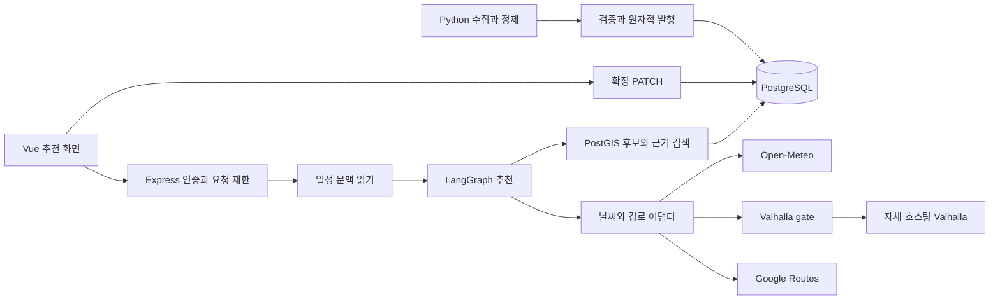
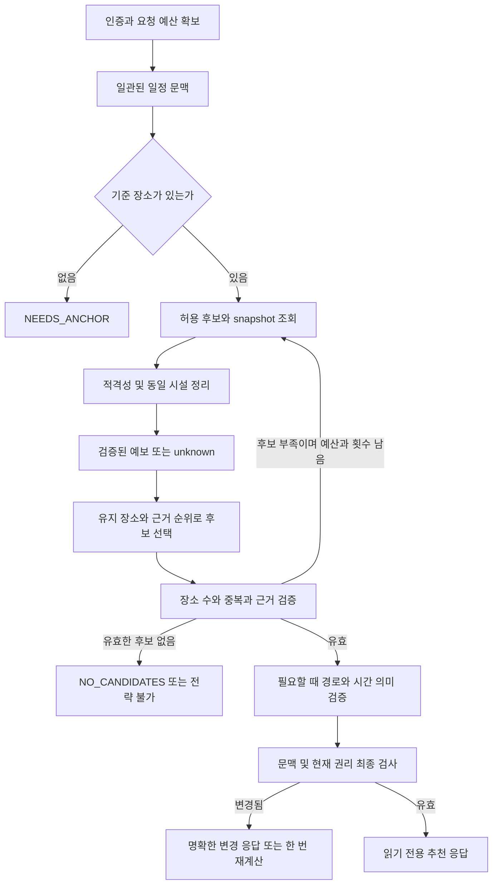
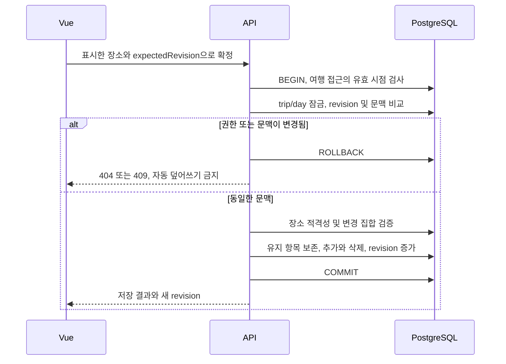
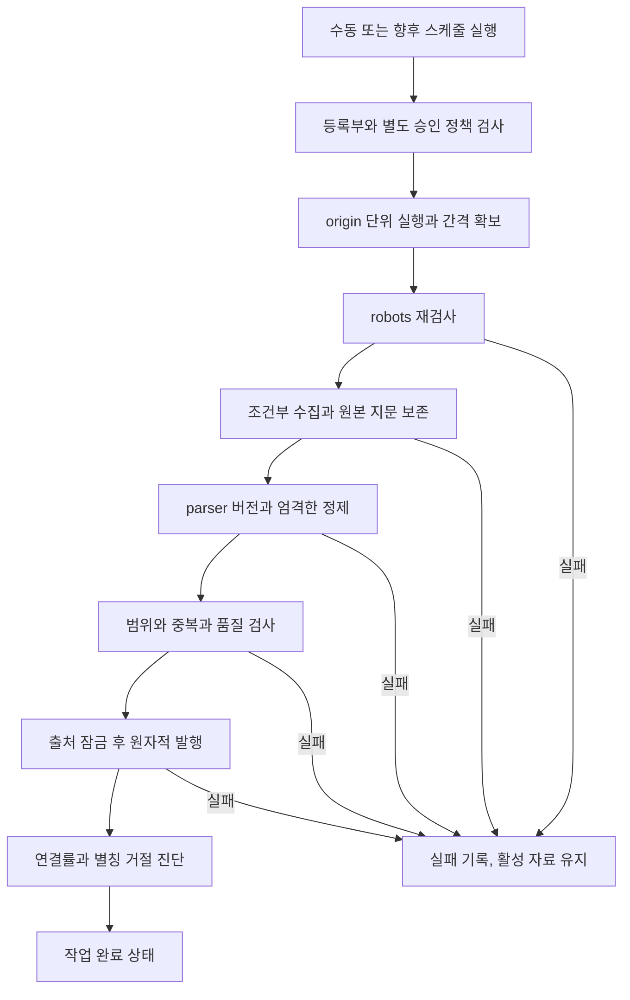

# Book해도 관광 추천 아키텍처·워크플로우 설계

> 후속 운영 수정: R1–R5/D1–D3의 구현 상태와 실제 검증은 [운영 코드 수정 기록](tourism-operational-implementation-20261006.md)을 따른다. 이 문서의 기준 커밋·반례·목표 설계는 원래 검토 시점을 보존한다.

작성일: 2026-10-06. 현재 구현 기준: `ver2@9e29e46`. 근거: [심층 리뷰와 재현 결과](tourism-deep-review-20261006.md).

이 문서는 **현재 구조와 앞으로 구현할 목표 설계**를 구분한다. 아래 새 타입·상태·테이블·단계는 구현 완료 보고가 아니다. 목표는 “완벽”이라는 형용사가 아니라, 각 결정의 전제·불변 조건·실패 처리·검증 기준을 명확히 하는 것이다. 앱 전체를 재작성하지 않고 관광 추천과 그 공통 기반부터 개선한다.

## 1. 제품 계약과 범위

사용자는 기존 하루 일정을 기준으로 후보를 비교하고, 자료와 이동정보의 신뢰 수준을 확인한 뒤 명시적으로 교체한다. 추천을 열거나 조회에 실패하는 것만으로 저장된 일정은 바뀌지 않는다. 공동 편집 시 다른 사람의 변경을 몰래 덮어쓰지 않는다.

추천은 네 가지 별도 판단을 포함한다.

| 판단 | 의미 | 성공해도 보장하지 않는 것 |
| --- | --- | --- |
| 장소 적격성 | 명시적 접근 금지·폐쇄·사용 범위 위반 없음 | 실제 현재 영업이나 현장 접근 가능성 |
| 근거 유효성 | 승인 출처, 허용 자료, 연결/유효기간/철회 조건 충족 | 원문이 최신 사실을 완벽히 반영함 |
| 경로 조회 성공 | 필요한 구간의 provider 응답이 유효함 | 연속 시각과 장소 체류까지 가능한 일정 |
| 일정 시각 일관성 | 앞 구간 도착 이후 다음 출발, 알려진 제약 충족 | 시간표 변경·정체·임시 휴업이 없음 |

`READY` 하나로 위 판단 전체가 통과했다고 표현하지 않는다. 단순 장소 교체는 경로 일부를 몰라도 허용할 수 있지만 “전체 이동시간을 확인했다”는 표시와 분리한다. 불확실한 영업시간을 자동으로 닫힘이나 열림으로 바꾸지 않는다.

## 2. 현재 아키텍처와 목표 경계

현재는 Vue + Express 모듈형 단일 서비스, PostgreSQL/PostGIS, 별도 Python 수집기다. 이 구조를 유지한다. 현재 문제의 주원인은 마이크로서비스 부재가 아니라 규칙과 계약의 불일치다.



위 그림은 현재 연결을 요약한다. 외부 AWS 저장소·스케줄러·LLM은 현재 연결 완료로 간주하지 않는다. 다음 경계가 목표다.

| 소유 모듈 | 소유하는 결정 | 금지하는 책임 혼합 |
| --- | --- | --- |
| HTTP adapter | 인증, 접근, 입력/출력 계약, 상태 코드, 요청 문맥 | 추천 순위·SQL 조립을 화면별로 복제 |
| RecommendationService | 문맥 읽기, graph 실행, 마지막 검증, 응답 조립 | 일정 쓰기 또는 외부 호출 중 DB 잠금 |
| PlacePolicy | 적격성, 동일 시설 판별, 전략별 soft preference | 저장된 일정을 자동 삭제 |
| TourismRepository | 허용 snapshot과 후보/근거 조회, live rights 검사 | 문구 생성, 임의 네트워크 호출 |
| Graph | 제한된 검색·계획·검증·분기 | 인증 판단, arbitrary SQL, 일정 확정 |
| Provider adapters | 응답 파싱, 단위, deadline, 오류 분류, 캐시 규칙 | 오류를 정상 숫자 또는 0으로 위장 |
| ItineraryCommandService | 잠금, 권한/버전, 변경 집합, 원자적 저장 | provider 응답을 기다리는 긴 트랜잭션 |
| Ingestion worker | 수집 상태, 정제, 품질 검사, 발행 준비 | 등록부 변경만으로 승인 정책 우회 |
| PublicationService | 출처 잠금·철회·버전 검사·전체 활성화 | 부분 행 발행, 실패한 수집을 최신으로 처리 |

현 `buildDayPlans`는 Router와 같은 파일에 있다. 순수 계산·공통 정책을 먼저 별도 모듈로 옮기고 일반 추천/관광 추천이 호출하게 한다. 이 과정은 동작을 바꾸는 커밋과 분리하거나 회귀 대조를 함께 남긴다.

## 3. 반드시 지킬 불변 조건

| ID | 불변 조건 | 확인 지점 |
| --- | --- | --- |
| I01 | 인증 사용자만 여행에 접근하며 소유자/수락 동행자만 허용 | 모든 trip route와 변경 트랜잭션의 정의된 권한 시점 |
| I02 | 추천 실행은 itinerary를 쓰지 않음 | graph 의존성에 쓰기 인터페이스 미노출, DB 변화 검사 |
| I03 | 명시적으로 부적격한 장소는 새 추천·확정에 포함하지 않음 | 공통 PlacePolicy, 확정 직전 catalog 확인 |
| I04 | 동일 시설 중복과 중복 ID를 구분하여 검사 | 후보 정규화, 유지 목록, plan 검증 |
| I05 | 인용은 정확한 source/snapshot/record/place 관계를 가짐 | 생성 검증과 최종 권리 조회 |
| I06 | 직선거리에는 실제 이동시간을 붙이지 않음 | RouteSegment 타입과 UI formatter |
| I07 | 구간별 성공과 연속 일정 가능성을 혼동하지 않음 | temporal 상태와 UI 안내 |
| I08 | day revision과 items는 동일한 읽기 시점의 값 | 단일 SELECT 또는 짧은 repeatable-read |
| I09 | 확정은 기대 revision을 검사하고 단 한 번 저장 | day 잠금 + revision + 원자적 변경 |
| I10 | 실패한 수집·정제는 활성 snapshot을 바꾸지 않음 | ingestion terminal state + publication gate |
| I11 | 철회는 snapshot 교체·prune 이후에도 유지 | stable ID withdrawal marker |
| I12 | timeout/취소는 하위 작업에도 전달되고 종료가 관측됨 | RequestContext, repository/provider/queue |
| I13 | 각 요청의 종료 계수는 정확히 한 번 감소 | finish/close 통합 finalizer |
| I14 | 모든 반복·대기열·입력·외부 응답은 자원 상한이 있음 | 재검색, bytes, queue, 전체 deadline |
| I15 | private 키·세션·원문 위치/관심 정보는 로그/metrics에 노출하지 않음 | redaction과 로그 fixture 검사 |

I03의 “명시적 부적격”은 access/private/no, disused, abandoned, closed 같은 확인 가능한 표시다. 휴무일 해석이나 영업시간 최신성 검사는 별도 기능이며 검증 없이 동일시하지 않는다.

## 4. 타입과 API 계약의 목표

현재 `any`를 모든 곳에서 한 번에 없애기보다 HTTP/provider/DB row→domain 경계부터 제거한다. 외부 입력은 `unknown`으로 받아 Zod 등으로 검증하며 내부는 검증된 타입만 사용한다. 공유 response schema에서 TypeScript 타입과 OpenAPI를 생성하거나 일관성을 검사한다.

```ts
// 제안 계약의 핵심 모양. 아직 서비스에 구현된 타입이 아니다.
type RequestContext = {
  requestId: string;
  signal: AbortSignal;
  deadlineMonotonicMs: number;
};
type EvidenceRef = {
  sourceId: string;
  snapshotId: string;
  externalId: string;
  canonicalPlaceId: string | null;
};
type SegmentResult =
  | { status: 'ROUTED'; provider: 'valhalla' | 'google';
      distanceMeters: number; durationSeconds: number;
      requestedDepartureAt: string | null }
  | { status: 'UNAVAILABLE'; reason: ProviderFailure;
      straightDistanceMeters: number; durationSeconds: null };
type ProviderFailure = 'TIMEOUT' | 'CANCELLED' | 'QUEUE_FULL'
  | 'INVALID_RESPONSE' | 'NOT_CONFIGURED' | 'NO_ROUTE' | 'UPSTREAM_ERROR';
type RecommendationHealth = {
  evidence: 'CITED' | 'CATALOG_ONLY' | 'NONE';
  weather: 'VALID' | 'PARTIAL' | 'UNAVAILABLE';
  routes: 'NOT_REQUESTED' | 'ALL_SEGMENTS' | 'PARTIAL' | 'NONE';
  timeline: 'NOT_EVALUATED' | 'COHERENT' | 'INCOMPLETE' | 'CONFLICT';
};
```

경로 수치의 단위·음수·유한성·범위는 adapter가 보장한다. optional 값의 `null`은 알 수 없음이며 0은 측정된 0이다. provider failure 원인은 서버 내부에서 구분하고 UI에는 필요한 수준으로 축약한다. URI·키·원문 예외 메시지는 응답에 노출하지 않는다.

추천 응답에는 현재의 trip/date/expectedRevision/expectedPlaceIds를 유지하면서, 구현 단계에서 다음을 추가한다.

- `contextVersion`: day revision, ordered place IDs, 교통수단, 출발 가정, 추천 조건을 식별하는 문맥 버전. day revision만으로 교통수단 변경을 검출할 수 없다.
- `validatedAt`, `expiresAt`: 검증 시점과 허용된 UI 보관 기간. 숫자 TTL은 제품/운영 측정 후 결정한다.
- `planFingerprint`: 실제 표시한 순서·근거 버전·조건을 식별. 클라이언트가 보낸 hash만으로 권한이나 유효성을 신뢰하지 않는다.
- 위 health 축과 구조화된 `warnings`·`partialReasons`. `generationMode`는 실제 adapter 실행에 따라 기록한다.

기존 API는 호환 기간 동안 유지하고 새 필드는 먼저 추가한다. status 의미를 바꾸는 경우 버전 전환을 명시한다. `complete` 하나의 의미를 조용히 바꾸면 이전 UI가 잘못 해석할 수 있다.

## 5. 추천 워크플로우



1. 인증/여행 권한과 사용자별 한도를 검사한다. edge 단계의 저비용 IP 제한을 고려하되 로그인 사용자별 한도와 대체 관계로 만들지 않는다. 현재 DB 기반 공유 한도는 유지한다.
2. 일관된 day/items/교통수단 문맥을 읽는다. 읽기 트랜잭션은 즉시 끝낸다. 기준 장소가 없으면 외부 호출 없이 NEEDS_ANCHOR를 반환한다.
3. 승인 출처의 활성 버전과 후보를 수집한다. 10/15/20km, 최대 3회라는 현재 상한을 기본 유지하되 매 재검색 전에 남은 예산을 확인한다. 검색 실패와 후보 0개는 다른 결과다.
4. 하드 적격성 → 시설 동일성 → 후보 대표 → soft ranking 순으로 처리한다. 이름이 같은 것만으로 실제 지점을 통합하지 않는다. 중복 판단의 신뢰도가 낮으면 별도 장소로 두고 근거를 기록한다.
5. 유지 장소는 기존 일정 순서를 보존한다. 유지 장소 수를 빼고 남는 수를 **근거 순위로 먼저 선택한 뒤** 동선 정렬한다. 기존 attachKept 회귀를 다시 만들지 않는다. 유효한 후보가 적으면 실제 수와 부족 사유를 표시한다.
6. 관심 주제 검색 점수, 시설 근거, 거리, 다양성은 각각 정의된 soft score로 전달한다. 현재 근거 점수 소실을 고치더라도 한일 검색을 자동으로 해결했다고 주장하지 않는다. 쿼리 번역·embedding은 별도 품질 평가 후 도입한다.
7. 모델 adapter를 도입할 경우 검색된 ID만 받도록 제한하고 동일 validator를 통과시킨다. validator 실패 시 rules fallback은 가능하지만 외부 실패 원인을 내부 지표에 남긴다. 지금은 모델 호출을 추가할 이유가 필수적이지 않다.
8. 미리보기가 필요할 때만 provider를 호출한다. 실패 구간은 null/직선거리로 표시한다. TRANSIT은 다음 절의 시간 정책을 적용한다.
9. 응답 직전 문맥과 현재 권리를 재검사한다. 조회 버전이 바뀌면 무제한 재시작하지 않는다. 최대 한 번의 재계산 또는 변경 응답을 선택해 예산을 지킨다.

비슷한 근거·동일한 후보의 재검색으로 결과만 반복하는 경우에는 이유를 남기고 일찍 끝낼 수 있다. 다만 권리 검사 생략을 성능 개선으로 취급하면 안 된다.

## 6. 시간과 이동 워크플로우

두 기능을 명확히 분리한다.

**구간 비교 모드:** 각 구간을 같은 기준 시각으로 조회할 수 있다. 응답과 UI에 “각 구간을 오전 9시 출발로 비교”라고 표시한다. `timeline=NOT_EVALUATED`. 구간 시간 합계가 있더라도 연속 하루 이동시간으로 표시하지 않는다.

**연속 일정 모드:** 출발시각과 사용자가 지정한 체류시간을 사용한다. 체류시간이 없는 경우 추정값을 조용히 넣지 않고 입력 필요 또는 미평가로 처리한다.

```text
depart[0] = 사용자가 정한 최초 출발시각
arrive[i+1] = depart[i] + provider가 반환한 해당 구간 소요시간
depart[i+1] = arrive[i+1] + 확인된 체류시간[i+1]
```

TRANSIT은 시각에 따라 다음 경로가 바뀌므로 순차 계산한다. 중간 구간이 unknown이면 뒤 구간에 가짜 출발시각을 전달하지 않는다. 공급자가 실제 도착시간을 제공하면 일관성을 검증하고 사용한다. 날짜 경계·JST 변환·마지막 차·서비스 조회 범위를 검사한다. [Google 공식 시각 제약](https://developers.google.com/maps/documentation/routes/transit-route).

정적 자동차/도보 거리 조회는 제한된 병렬성을 사용할 수 있다. 정체·적설·실시간 운행을 반영하지 않는 Valhalla의 안내를 유지한다. 영업시간 충족 검증은 파싱 가능한 신뢰된 정보가 있을 때만 하고 historical/null이면 unknown으로 둔다.

검색용 일정 중심점은 실제 출발지가 아니다. plan의 비교 거리는 첫 장소→마지막 장소 사이로 통일하고 중심→첫 장소의 거리는 별도 `anchorDistance`로 표시하는 안을 권한다.

## 7. 취소·마감시각·자원 상한

목표는 모든 단계가 하나의 요청 예산을 공유하는 것이다. `min(단계별 상한, 남은 전체 예산)`만 사용할 수 있다. 현재 Node의 requestTimeout은 요청 수신 제한이므로 별도의 handler deadline이 필요하다. [Node HTTP 문서](https://nodejs.org/api/http.html#serverrequesttimeout).

| 계층 | 목표 동작 | 검증 |
| --- | --- | --- |
| Vue | 새 조회·닫기·날짜 변경·unmount 시 이전 fetch abort | generation 검사도 계속 유지하여 race 방어 |
| HTTP | 정상 finish 전 close에만 취소, 정상 종료와 중단 분리 | response finalizer exactly once |
| Graph | 상태·node 전환마다 signal과 남은 예산 확인 | 중단 후 검색/경로 신규 호출 0 |
| SQL | 짧은 statement budget, query cancellation 또는 안전한 연결 폐기 | 다른 요청의 쿼리를 취소하지 않음 |
| Provider | fetch/body 읽기까지 signal 전달, byte/스키마 상한 | 큰 응답·지연 body·잘못된 JSON |
| Queue | 대기 중 abort 시 즉시 제거, 실행 중은 작업 종료 후 permit 반환 | permit 음수/누수 없음 |
| Cache | 검증된 값만 저장, 호출자 취소가 타인에게 전파되지 않음 | 두 사용자 중 한 명만 취소 |

`Promise.race` 자체는 작업 취소가 아니다. DB client를 조기에 pool에 반환해 아직 실행 중인 쿼리가 다른 요청과 섞이지 않게 한다. PostgreSQL driver의 지원 범위를 실제 설치 버전에서 확인한 뒤 query 취소를 구현한다. 외부 body 읽기까지 permit을 유지하는 현재 Valhalla gate 동작은 보존한다.

제안 초기 응답 목표는 일반 추천 p95 3초, 경로 포함 p95 8초, 요청 hard deadline 15초다. **측정된 현재 성능이나 확정 SLO가 아닌 실험용 가정**이다. 콜드 캐시·느린 provider·TRANSIT 순차 요청에서 충족하지 못하면 숫자를 숨기지 말고 구간 비교 우선·비동기 작업 전환·예산 재설정을 검토한다. API 전체 운영 목표는 별도 확정한다.

Valhalla 현재 process gate는 8/128이다. API 인스턴스가 N개면 실행 허용은 최대 N×8이다. 고정 상한이 필요하면 routing gateway 또는 공유 lease limiter를 별도 도입한다. 사용자당 분당 30회는 동시성·외부 비용 상한이 아니다. Google와 날씨의 계정 전체 제한도 따로 평가한다.

신호가 있는 호출의 dedup 비활성화는 현재 안전한 취소 격리 선택이다. 공유 진행 요청을 다시 도입하려면 subscriber별 취소와 마지막 subscriber 종료 때만 upstream abort하는 참조 관리가 필요하다. 단순히 `deduplicate=true`로 바꾸지 않는다.

## 8. 읽기 일관성·자료 철회·확정 저장

### 읽기와 권리의 시점

정적 자료 일관성과 동적 철회는 다르다. 추천 한 번의 장소·근거 계산은 pin한 버전을 사용하고, 응답 전 사용 허용 여부는 현재 DB 값으로 다시 확인한다. 현재 검색은 pin과 active 일치를 동시에 요구하므로 발행 교체 중에는 근거가 사라질 수 있다. 이 동작을 “이전 버전 계속 사용”으로 바꿀지는 계약 변경이다.

초기 권장안은 **최종 검사 시 active가 바뀌면 근거를 재선별하거나 변경 응답**이다. 이전 snapshot을 계속 읽을 필요가 생기면 “승인된 비활성 버전도 TTL 동안 사용 가능”을 별도 정책으로 추가한다. 어느 경우든 권리 철회·비활성은 우선한다.

최종 검사는 SQL 한 문장으로 source 상태, active snapshot, withdrawal, validity를 검사하고 `validatedAt`을 반환한다. 검사 직후의 철회가 네트워크 전달보다 먼저 완료될 수 있다는 경계는 남는다. 검사 시점 이후 이미 전송한 내용을 즉시 지우는 것을 보장하려면 별도 전달/화면 무효화 프로토콜이 필요하다. 긴 DB 잠금으로 외부 호출을 감싸지 않는다.

### 확정 트랜잭션



잠금 순서는 코드 전체에서 문서화한다. 권장 순서는 여행 → day → item이며 복수 day는 정렬된 ID 순이다. membership 변경 기능을 추가할 때도 동일한 여행 잠금 규칙을 따른다. 현재 권한 미들웨어가 모든 동시성 의미를 보장한다고 가정하지 않는다.

남는 장소의 note/cost/start/end와 가능하면 item ID를 유지하고, 새 장소만 생성하며 제외 장소만 삭제한다. 현재는 전부 delete/reinsert하므로 후속 item 참조 기능 추가 시 식별자 안정성을 먼저 검토한다. 기존 외래키·응답 의존을 확인한 뒤 변경한다.

서버 확정 조건은 표시한 추천 자체를 승인하는지, 장소 목록 변경만 승인하는지 구분한다. 전자는 server-stored proposal 또는 서명된 문맥+서버 재검증이 필요하다. 단순 hash는 조작 방지 수단이 아니다. 후자는 근거 변동으로 일반 catalog 장소 저장까지 무조건 금지하지 않고 안내만 갱신할 수 있다.

연결 끊김이 COMMIT 이후 발생하면 저장 여부를 사용자가 모를 수 있다. day revision과 결과를 다시 읽어 확인하는 복구 경로를 먼저 제공한다. 자동 재전송이 필요하면 `(user, operation, idempotencyKey)` 고유키와 request hash, 완료 응답을 **같은 트랜잭션**에 저장한다. 기존 요청의 idempotency 결과를 새 revision 검사보다 먼저 처리하는 순서가 필요하다. 같은 키의 다른 본문은 거절한다.

## 9. 수집·정제·발행 워크플로우



현재의 local SQLite 상태와 파일 잠금은 **같은 state directory를 사용하는 단일 호스트 작업**에 적합하다. 다른 디렉터리/호스트의 실행 간 상호 배제를 제공하지 않는다. 새 scheduler를 연결할 때 동일 origin의 여러 source가 공유 제한을 우회하지 않도록 origin lease와 next-allowed-at를 중앙 저장한다. 시각 변경과 중도 종료도 시험한다.

작업 상태는 `QUEUED → RUNNING → VALIDATED → PUBLISHED | UNCHANGED | FAILED | CANCELLED`로 명시한다. 최종 성공 보고만 저장하지 말고 시작과 종료를 기록한다. 임시 파일/네트워크 재시도/최대 실행시간/응답 크기에 각각 상한을 두며 영구 오류는 반복하지 않는다. 원본 파일의 content hash, source policy version, parser version, fetch 시각을 기록한다.

발행 전에는 다음을 확인한다.

1. 출처의 승인·활성·라이선스와 source/resource/parser/region/kind 일치.
2. 수집 성공과 원본 지문 일치, 완전한 정제, stable ID 중복 없음.
3. 시설 연결은 보수적인 이름/지역/거리 조건 또는 승인 별칭의 현재 지문 일치.
4. 명백한 좌표·날짜 오류와 갑작스러운 행수 감소·연결률 하락을 구분. 감소만으로 자동 데이터 보정을 하지 않으며 검토 대기로 전환할 임계치는 출처별로 정한다.
5. 출처 잠금 뒤 현재 active 및 fetch 시각 재검사. 오래된 작업이 최신 버전을 덮지 않음.
6. snapshot·record 전체와 active 전환이 같은 트랜잭션. 철회 표식은 새 버전에 상속.
7. 발행 결과에 연결 수·거절 이유·aliasReview·사용한 버전을 반환. 실패 시 이전 active 유지.

발행 멱등성 키는 source + parserVersion + 원본/정제 해시 + fetchedAt 등 실제 동등성 계약으로 정한다. parser 동작을 바꾸면 버전 증가와 재처리 정책이 함께 필요하다. 같은 자료를 다시 확인한 fetch와 내용 변경을 구분하되 출처의 실제 업데이트 시각으로 오인하지 않는다.

현재 prune의 활성/최근 30일/최신 3개 보호를 초기 유지한다. 삭제 적용은 백업·복원 기준과 함께 운영 문서에 연결하며 수집 성공과 자동으로 묶지 않는다. 철회 해제는 source와 stable ID의 record/marker를 일관되게 바꾸는 별도 감사 가능한 명령으로 설계한다. 일반 재발행이 해제 역할을 해서는 안 된다.

## 10. UI 상태와 오류 의미

권장 상태는 `CLOSED → LOADING → LIST → PREVIEW → SAVING → CLOSED`이며 오류/조건 변경은 각 상태의 명시적 분기다. 별도 busy/saving/result 조합이 모순을 만들지 않도록 discriminated union 또는 작은 상태 모델로 묶는다. 현재 generation guard와 revision 검사는 유지한다.

| 사건 | 목록 | 미리보기 | 서버 작업 | 일정 |
| --- | --- | --- | --- | --- |
| 같은 조건의 429/일시 오류 | 유지 | 확정 가능한 값 제거 | Retry-After 이후 명시적 재시도 | 변경 없음 |
| 조건/날짜/여행 변경 | 무효화 | 제거 | 이전 요청 취소 | 변경 없음 |
| 409 문맥 충돌 | 오래됨 표시 | 제거 | 최신 일정 조회 | 덮어쓰기 없음 |
| 일부 경로 실패 | 유지 | 부분 결과/원인 표시 | 자동 무한 반복 금지 | 사용자의 명시적 교체 전 불변 |
| 출처 철회/교체 | 해당 근거 제거 또는 새 결과 | 재검증 필요 | 제한된 재조회 | 저장된 일정은 자동 삭제하지 않음 |
| 저장 응답 유실 | 저장 여부 확인 중 | 재전송 대신 상태 확인 | revision/멱등성 조회 | COMMIT 여부에 따라 표시 |

현재 `ApiError`는 Retry-After와 availableStrategies를 별도 필드로 보존하지 않는다. 사용자 복구에 쓸 필요가 있는 필드만 typed metadata로 전달하고 화면에서 합리적으로 안내한다. provider detail이나 민감값을 통째로 내보내지 않는다.

## 11. 관측·배포·데이터 권한

지표는 HTTP 정상/중단/실패, graph node별 시간·검색 횟수·제외 사유, provider queue wait·실행시간·실패 유형, DB wait·timeout, 연결률·자료 age로 구성한다. 사용자 ID·trip ID·좌표·관심 문자열·source URL을 metric label로 쓰지 않는다. 낮은 수의 정해진 코드로 집계하고 필요한 상관관계는 requestId 로그로 남긴다.

HTTP in-flight와 background work in-flight를 별도 측정한다. “요청 종료” 후 작업이 계속 실행되는 문제를 숨기지 않는다. provider try/catch가 fallback을 반환해도 실패 이유는 집계한다. Valhalla의 queue full을 provider 다운과 구분한다.

배포 단위는 우선 web/API, ingestion worker, Valhalla, PostgreSQL 네 개의 역할로 구분한다. API DB 권한은 planner 업무 쓰기 + catalog/tourism 읽기, 수집 발행 권한은 tourism 쓰기 + catalog 읽기, migration은 별도 계정으로 나누는 목표가 적절하다. **현재 배포 권한이 그렇게 설정돼 있다고 확인한 것은 아니다.**

AWS가 필요해지면 기존 경계를 ECS/ALB/RDS/S3 등의 역할에 매핑할 수 있지만 서비스 이름이 품질을 보장하지 않는다. S3 raw/curated 저장·scheduler·비밀 관리·origin lease·backup IAM을 각각 구현하고 검증해야 한다. 지금 작업에서 새 cloud 자원을 만들지 않는다.

## 12. 검증 매트릭스와 출시 단계

| 검사 | 정상 대조군 | 실패/경계 | 완료 기준 |
| --- | --- | --- | --- |
| 적격성 | hours null인 정상 장소 | 두 closed 필드, private/no, 조회 후 폐쇄 | 일반/관광/확정 정책 동일 |
| 시설 동일성 | 다른 지점·동명이인 | node/way 중복, 두 번째에만 근거 | 중복 방문 없음, 근거 보존, 과잉 병합 없음 |
| 시간 | 올바른 연속 출발 | 9시 독립 구간, 체류 미입력, 자정, 첫 구간 실패 | timeline과 구간 성공 상태 분리 |
| 날씨 | 0%/0mm/선택 항목 null | 음수/역전/문자열/999/중복 날짜 | 잘못된 정상 응답·캐시 0 |
| 취소 | 정상 완료 | 브라우저 종료, queue 중단, DB 지연 | 신규 하위 호출 중지, 허용 시간 내 자원 회수 |
| 관측 | finish→close | close만 발생, handler 오류 | in-flight 원복, 중복 계수 없음 |
| 시점 | revision/items 동일 | SELECT 사이 동행자 수정 | 동일 시점 응답, 확정 충돌 보존 |
| 권리 | 활성 승인 근거 | 경로 중 철회/비활성/새 발행 | 정의한 최종 검사 시점 준수 |
| 멱등성 | 최초 저장 | COMMIT 후 연결 종료, 같은 키 다른 본문 | 중복 변경 없음, 상태 조회 가능 |
| 수집/발행 | 200/304, 정상 CSV | 429/5xx/robots 실패/오래된 작업/별칭 불일치 | 이전 active 유지, 명확한 종료 사유 |
| 부하 | warm/cold cache | 1/5/10/20 동시 사용자, 다중 프로세스, 느린 provider | 목표 지연·상한·실패율 측정, 무한 queue 없음 |
| 복원 | 정상 백업 복원 | 최근 발행·철회·prune 뒤 복원 | 실제 자료/철회/권한 확인, RPO/RTO 실측 |

출시 단계 A는 R1/R2/R4/R5의 작은 수정과 독립 회귀 테스트다. B는 D1의 부모 취소와 전체 예산, provider 상태 타입이다. C는 R3/D2/D3의 시간·문맥·권리 계약 전환과 브라우저 검증이다. D는 실제 배포 부하·복원·자료 품질 측정이다. 단계별로 기준 입력과 수정 전 실패를 보존한다.

CI에는 공통 정책·취소·DB barrier·실제 HTTP 중단 회귀를 추가한다. CI 관광 E2E의 fixture와 실제 자료·provider smoke는 계속 구분한다. 외부 네트워크의 일시 오류 때문에 결정적 기능 회귀를 숨기거나, 라이선스 정책을 완화해 테스트를 통과시키지 않는다.

DB 변경은 expand→배포→검증→후속 정리 순서로 하고 기존 migration checksum을 수정하지 않는다. rollback은 앱 버전 되돌리기와 데이터 복원을 구분하며, 철회·승인 상태를 과거 snapshot으로 되돌려 무효화하지 않는다.

## 13. 남는 의사결정과 완료의 정의

현재 제안은 추천 조회 시점의 근거 확인, 사용자의 명시적 장소 교체, 보수적인 매칭을 기본으로 한다. 이후 결정해야 할 것은 연속 일정의 체류시간 입력 방식, 자료 TTL/철회 화면 갱신 주기, 배포 인스턴스 수와 공급자 예산, 출처별 품질 경보 임계치, 실제 RPO/RTO다. 이 값들은 코드 리뷰만으로 확정할 수 없다.

완료 조건은 문서 작성이 아니라 **불변 조건의 실제 구현, 해당 반례의 수정 전 실패/수정 후 통과, 원격 CI, 배포 환경의 측정**이다. 새로운 지역/LLM/cloud를 추가하더라도 이 계약을 통과해야 한다. 검증하지 않은 부분은 unknown으로 남기며 무결함이나 무제한 처리량을 약속하지 않는다.
