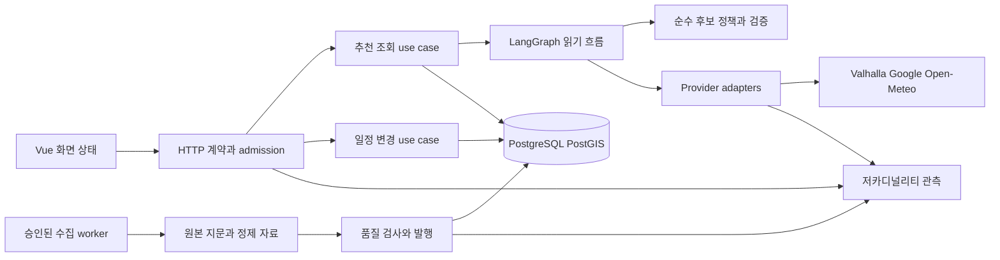
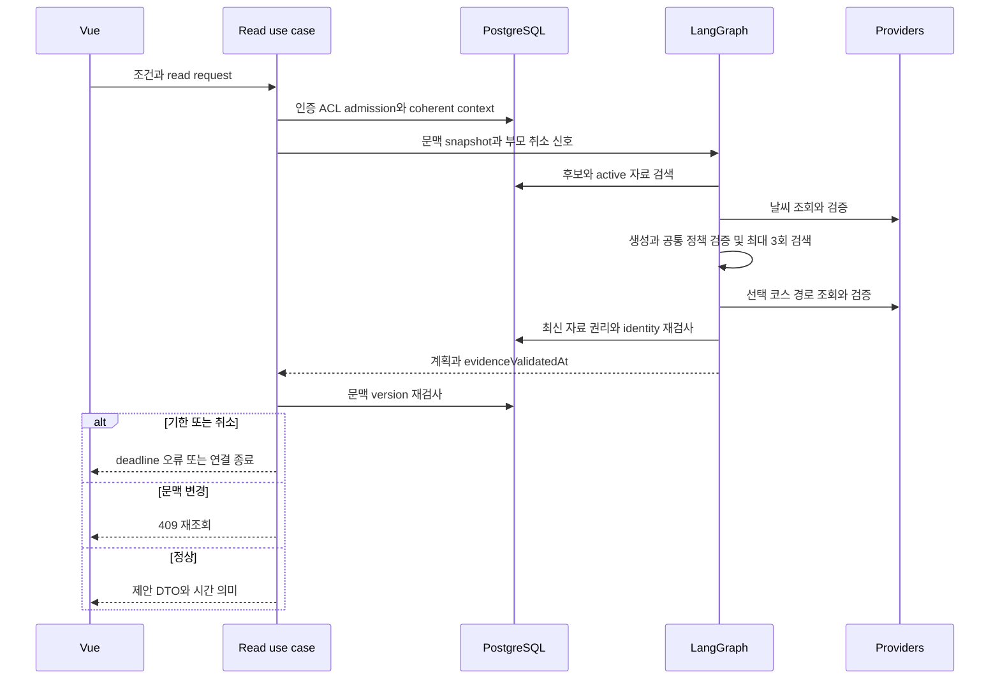
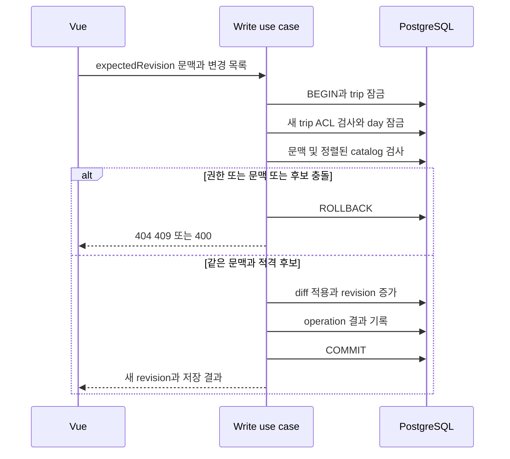
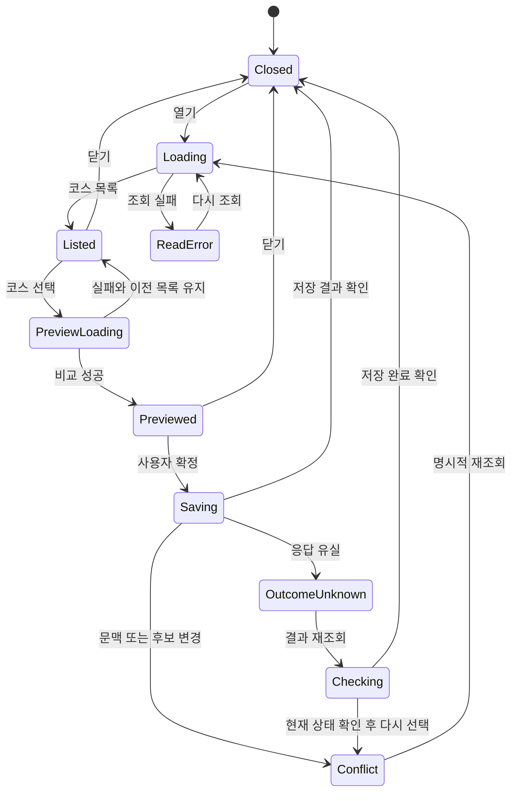
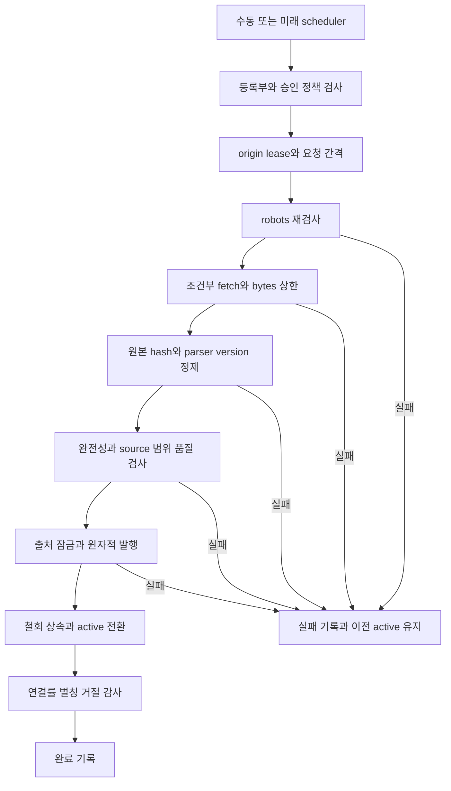

# Book해도 목표 아키텍처와 워크플로우 — 운영 수정 후 재설계

기준은 `ver2@3fa83a1`이다. [재리뷰](tourism-rereview-20261006.md)의 F1–F4와 O1을 해결할 목표 설계이며 이 문서만으로 해당 구현·운영 배포가 완료된 것은 아니다. 현행과 목표를 매 절에서 구분한다. 무결함을 선언하는 대신 실패·취소·동시 변경의 계약과 수락 검사를 정의한다.

## 1. 제품 계약과 시스템 경계

서비스는 관광 자료와 catalog·예보·경로를 참고하여 방문 장소를 제안하고 사용자가 확정한 변경을 저장한다. 장소 소개의 존재, 현재 영업, 행사 개최 확정, 실제 도로 경로, 연속 시간표 실행 가능성은 서로 다른 사실이다.

- 현행 LangGraph.js는 실제 `StateGraph`를 compile/invoke하여 검색·날씨·규칙 생성·검증·재검색·경로·최종 자료 검사를 실행한다. AWS 연결이 없어도 이 로컬 라이브러리는 동작한다.
- 운영 graph에는 외부 LLM generator가 설정되지 않았고 `generationMode=rules`다. 생성 adapter 인터페이스의 존재를 LLM 연결 완료로 표시하지 않는다.
- compile에 영속 checkpointer가 없다. 요청 중 프로세스가 종료되면 조회는 다시 시작한다. durable resume, AWS/S3/EventBridge/Step Functions/ECS 배포는 현행 코드가 보장하지 않는다. [LangGraph 공식 개요](https://docs.langchain.com/oss/javascript/langgraph/overview)는 프레임워크의 기능 설명이지 이 앱에서 모든 기능을 구성했다는 증거가 아니다.
- 조회는 DB의 일정 상태를 변경하지 않는다. 사용자 확정은 별도의 쓰기 use case이며 조회 AbortController로 COMMIT을 취소하지 않는다.
- 초기 구조는 모듈화한 단일 API + PostgreSQL/PostGIS + 별도 수집 worker다. 확장성 측정 없이 microservice·메시지 브로커·LLM을 먼저 추가하지 않는다.

## 2. 불변 조건과 책임자

| ID  | 요구 조건                                                      | 책임 경계                          | 검사                                             |
| --- | -------------------------------------------------------------- | ---------------------------------- | ------------------------------------------------ |
| I1  | 여행 접근은 owner 또는 accepted member, owner 작업은 별도 구분 | admission ACL와 write use case     | 익명/다른 회원/owner/member 및 권한 변경 barrier |
| I2  | revision·items·mode는 같은 read snapshot                       | coherent trip repository           | F2의 두 읽기 사이 변경, metadata 포함            |
| I3  | 예상 day/context version의 확정은 관련 변경과 순서가 정해짐    | trip→day 잠금과 write transaction  | F1 양 방향 경합·ABA·교착                         |
| I4  | 모든 추천·추천 확정의 적격성과 시설 중복 정의 동일             | 순수 PlacePolicy                   | F3, NFKC·10m 경계·다른 지점                      |
| I5  | 인용은 조회한 정확한 record/place에만 연결                     | evidence repository·최종 validator | 다른 ID transfer 금지·철회·active 교체           |
| I6  | 유효하지 않은 provider JSON/geometry는 캐시 금지               | unknown→schema provider adapter    | F4, 잘못된 값 뒤 정상 재시도                     |
| I7  | 구간 성공·geometry·연속 timeline·운임은 독립 상태              | typed route result와 UI            | TRANSIT 독립 시간, geometry 누락, fare unknown   |
| I8  | 읽기 취소는 신규 하위 작업을 막고 기존 자원은 제한 안에 회수   | 요청 scope·SQL·provider gate       | 연결 유실·pool wait·body 지연·queued abort       |
| I9  | 쓰기 결과 불명확을 실패 확정/자동 재전송으로 취급하지 않음     | command result·coherent reload     | COMMIT 전/중/후 socket 종료                      |
| I10 | 수집 실패·철회는 원본 active와 철회 기록을 손상하지 않음       | worker·publish/prune transaction   | 실패·오래된 작업·재발행·복원                     |
| I11 | 외부 호출 동안 DB transaction/lock을 유지하지 않음             | orchestration과 repository 분리    | 느린 provider 중 pool/lock 관측                  |
| I12 | 미측정 상태를 성공·안전·운영 용량으로 승격하지 않음            | DTO·문구·검증 기록                 | unknown/null/fallback/fixture 경계               |

각 endpoint가 위 표의 어떤 정책을 사용하는지 route contract 목록으로 관리한다. 등록 위치가 바뀌어 ACL·limiter가 빠지는 회귀도 integration 검사로 잡는다. 순수 함수 통과만으로 실제 HTTP 경로의 적용을 주장하지 않는다.

## 3. 모듈 구조와 타입 계약

목표 의존성 방향은 HTTP adapter → application use case → 순수 domain policy + repository/provider interface다. `tourism-graph`가 Router와 확정 SQL을 가진 모듈에서 순수 helper를 import하는 현행 결합을 풀어야 한다.

| 영역                          | 목표 책임                                                    | 금지하는 의존/행동               |
| ----------------------------- | ------------------------------------------------------------ | -------------------------------- |
| domain/place-policy           | eligible·sameFacility·canonical representative·chain variety | HTTP·DB·fetch·사용자 권한        |
| domain/plan                   | center·선택·순서·ID/거리/날씨 검증                           | source 승인 변경·writes          |
| application/recommendation    | deadline·문맥·graph·최종 재검사·DTO                          | SQL 문자열 조립·장기 transaction |
| application/itinerary-command | ACL 시점·잠금·version·diff·저장 결과                         | 외부 provider·생성 모델          |
| repositories                  | coherent snapshot·bounded read·원자적 쓰기                   | API 응답·UI 문구·모델 호출       |
| provider adapters             | raw unknown schema·상태 분류·취소·캐시                       | 확정·DB writes·미검증 값 반환    |
| ingestion                     | 승인 정책·robots·origin gate·정제·발행·감사                  | 새 출처 자동 승인·별칭 자동 승인 |
| HTTP/UI                       | 입력·에러 계약·상태 전이·접근 가능한 안내                    | 클라이언트 검증만으로 확정 승인  |

타입 전환은 `Place`, `DaySnapshot`, `TripContext`, `EvidenceRef`, `Plan`, `RouteResult`, `RecommendationResult` 순서로 한다. DB row는 adapter에서 변환하고 외부 JSON은 항상 unknown에서 시작한다. tests/scripts용 타입 검사는 별도 config로 추가하되 실행 fixture의 고의적인 malformed 입력은 unknown으로 표현한다.

목표 RouteResult의 상태는 다음을 독립적으로 둔다. 값의 상세 크기 상한은 provider별 계약·실제 분포를 확인하고 설정한다.

- measurement: routed | straight_line | unavailable. routed만 provider distance/duration을 가진다.
- geometry: valid | absent | invalid. invalid는 adapter에서 정상 route cache에 넣지 않는다. geometry absent에 수치 routed를 허용할지는 UI 계약으로 결정한다.
- timeline: independent_segments | validated_sequence | unknown. 현행은 independent_segments/NOT_EVALUATED다.
- fare: provided | unknown. unknown을 무료로 표현하지 않는다.
- failureReason 내부 enum: cancelled | deadline | network | quota | queue_full | invalid_response | no_route. 원문 URL·키·헤더·좌표는 로그·metric label에 넣지 않는다.

장소 동일성 10m와 체인 다양성은 다른 정책이다. 10m는 현행 추천 중복 heuristic이며 법적 identity나 catalog 병합 기준이 아니다. 거리 snap tolerance도 10m를 그대로 재사용하지 않는다.

## 4. 추천 조회와 시점 계약

현행 관광 조회의 context version 검사와 최종 evidence 재검사는 유효하다. 일반·날씨 대안은 같은 시작 snapshot을 쓰지만 관광 라우트처럼 최종 context 재검사를 모두 수행하지 않는다. 목표에서는 세 경로의 snapshot·오류·재검사 계약을 일치시킨다. 생성과 경로 계산 중 추가 DB 잠금을 유지하지 않는다.

초기 read snapshot에는 trip/day ID, day revision, ordered items와 note/cost/schedule, mode, context version, catalog/policy version을 담는다. 일부만 필요하면 내부 projection으로 줄이되 API 복구 snapshot은 서로 다른 시점의 값들을 섞지 않는다.

마지막 자료 검사는 최종 SQL snapshot의 active/rights/withdrawal/validity/record-place identity를 기준으로 한다. 검사 이후 발생한 철회는 이미 전송된 내용을 소급 회수하지 않는다. 엄격한 즉시 회수가 제품 요구라면 evidence version 상태 조회·TTL·화면 재검사·서버 이벤트를 별도 설계해야 하며 그래프 마지막 노드 하나가 이를 보장하지 않는다.

snapshot 교체로 인용이 사라지면 KNOWLEDGE만 제거하고 사용할 수 있는 catalog 코스는 유지한다. 재검색이 필요하면 동일 전체 deadline과 최대 attempts 안에서만 수행한다. snapshot pin이 이전 active를 계속 사용해도 된다는 허가로 바뀌지 않는다. 지역 행사와 recurring/unknown 참고 목록은 시설 인용·READY·자동 일정에 섞지 않는다.

## 5. 조회 취소·예산·용량

현행 설정은 handler/graph 15초, read SQL 문장 3초, pool 획득 후 protocol 전체 3.5초, 취소 transport 전체 1초·2실행/32대기, pool max 10이다. handler budget은 인증·전체 limiter·trip ACL 뒤 시작하므로 end-to-end 15초가 아니다. Node requestTimeout은 요청 수신 제한이다. [Node HTTP 계약](https://nodejs.org/api/http.html#serverrequesttimeout).

목표는 읽기 요청에 admission 이전부터 하나의 상위 scope를 만들고 admission·DB acquire·query·provider·직렬화 직전까지 남은 시간을 전달하는 것이다. 하위 budget은 `min(하위 상한, 부모 남은 시간)`이다. timer는 실제 요청마다 무조건 새로운 15초를 주어 기한을 연장하지 않는다. Node 이벤트 루프가 막히면 timer도 늦어질 수 있어 CPU 작업과 외부 body 크기도 제한한다. subtask가 abort를 무시하면 Promise race만으로 자원 회수가 되지 않는다.

- pool wait 중 취소된 Promise의 늦은 연결은 SQL을 시작하지 않고 반환한다. pool waitingCount, 체류시간과 late acquisitions도 관측한다.
- 실행 중 SQL은 같은 역할의 별도 transport로 취소하고 transport 종료 후 대상 연결을 폐기한다. 실행 결과 확인이 불가능한 socket에 ROLLBACK을 더 queue하지 않는다.
- parent aborted 뒤 새로운 DB/fetch 작업을 시작하지 않는다. Promise의 late rejection도 수거한다.
- provider slot은 headers 수신이 아니라 body 처리 종료까지 유지한다. queue wait도 provider budget에 포함한다.
- browser generation과 AbortSignal을 함께 사용한다. aborted 이전 결과가 새 화면을 덮지 않으며 writes에는 read abort를 공유하지 않는다.
- pre-handler DB wire 손실과 rate store 장애도 HTTP 응답 기한·fail-closed를 검사한다. 최종 deadline 없이 서버 statement timeout만 믿지 않는다.

현행 고정 window 사용자 30/60초는 경계에서 약 60회 burst가 가능하고 계정 수 전체를 제한하지 않는다. Valhalla 8/128 gate는 프로세스별이며 N개 API는 최대 N×8의 활성 요청을 보낼 수 있다. 필요하면 공급자 공통 budget을 중앙 admission에서 배분한다. weather/Google과 전체 추천 작업의 admission도 각각 측정한다. 완료 cache hit와 cold miss는 구분한다.

대략적인 DB 연결 설계식은 `API 인스턴스 수 × (pool 10 + cancel 2) + worker/운영/monitor 연결 + reserve`다. 실제 최대 연결 수·worker pool·upstream threads는 배포값을 확인해야 한다. 8개 slot이나 분당 30회가 최적 운영값이라는 측정은 아직 없다. queue를 무조건 늘리면 지연과 timeout만 늘 수 있다.

동일 provider flight를 공유하려면 flight 자체 deadline, subscriber별 abort, 마지막 subscriber 이탈 시 upstream abort, bounded subscribers/bytes/queue가 함께 필요하다. 완료된 값을 복제하여 읽는 현행 cache는 유지한다. Google 정책상 결과 보관을 허용하지 않는 항목의 TTL을 성능 때문에 늘리지 않는다.

## 6. 저장 원자성·잠금과 문맥 version

F1 목표 계약은 **mode/일정 변경을 확정 COMMIT 전까지 경쟁하는 쓰기로 취급**하는 것이다. 단순히 검사 SQL 시점만 보장하겠다는 제품 계약도 가능하지만 이를 명시해야 한다. 여기서는 일관된 저장과 오류 복구를 위해 강화한 계약을 선택한다.

초기 구현은 trip 행을 먼저 FOR UPDATE, 다음 day를 FOR UPDATE, 필요한 catalog 행을 정렬된 ID 순 FOR SHARE로 잠그고 검증한다. all-write 경로의 잠금 순서를 함께 전환해야 한다. 여러 trip/day를 변경하는 명령은 정렬된 ID 순이며 catalog import writer의 순서도 확인한다. 외부 네트워크는 잠금 안에서 실행하지 않는다. [PostgreSQL 잠금 순서](https://www.postgresql.org/docs/17/explicit-locking.html#LOCKING-DEADLOCKS).

- trip mode/cost 등 추천 의미에 영향을 주는 설정에 context_revision을 도입할 수 있다. expand migration으로 추가하고 모든 해당 writer가 증가시킨 뒤 read/confirm에서 required로 전환한다. title 변경까지 코스를 무조건 취소할지는 과잉 무효화 여부를 보고 결정한다. 초기 최소 수정은 기존 expectedTransportMode+trip 잠금이며 context revision 확장은 후속이다.
- mode A→B→A의 중간 변경도 무효화하려면 현재 값 비교만으로 충분하지 않아 context version이 필요하다. 같아진 의미를 허용할 제품 정책이면 ABA 거절을 무조건 요구하지 않는다.
- 여행 권한의 최종 검사는 trip 잠금 뒤에 한다. 미래 member 제거와 ACL writer도 같은 trip 잠금을 사용해야 한다. 현행 request-start 승인만으로 account suspension/session logout의 즉시 COMMIT 금지를 보장하지 않는다.
- principal 정지까지 COMMIT 전 보호하는 강한 계약을 요구하면 사용자 상태/세션 root 잠금과 모든 admin/account-deletion writer를 포함해 principal→trip→day 순서로 별도 전환해야 한다. trip lock 하나가 이 정책까지 해결한다고 주장하지 않는다.
- candidate의 폐쇄·접근·좌표·이름에 대한 내부 catalog 변경을 COMMIT까지 막으려면 catalog row lock이 필요하다. 자료 원문에서 실제 휴업이 발생하는 것까지 DB lock으로 막을 수는 없다.
- 새 장소는 2..6개, unique ID와 공통 시설 unique, 보수적 거리 조건을 검사한다. rank 함수와 confirm의 전체 집합 검사를 함께 적용한다. 날씨 대안은 target 제외 후 remaining+replacement를 검사한다.
- 현재 ID 전체 delete/reinsert 대신 diff를 제안한다. retained item의 ID/note/cost/schedule 유지, removed만 삭제, added만 생성한다. position 변경은 기존 unique 제약과 충돌하지 않는 두 단계/deferrable 설계를 선택하고 FK·참조 사용처를 먼저 확인한다.
- 날씨 대체 시 target의 note/cost 초기화는 현행 계약이다. start/end slot 유지 여부는 명시해 사용자에게 알리고 영업 가능성을 확인한 것으로 읽히지 않게 한다.

write transaction은 lock/statement/전체 예산이 필요하다. HTTP disconnect만으로 COMMIT을 취소하지 않는다. 결과를 모르는 진행 중 COMMIT을 실패로 판정하거나 무조건 rollback 뒤 재전송하지 않는다. deadline 정책은 queued/pre-commit과 committing/committed를 구분한다.

## 7. 저장 결과 불명확·멱등성

최소 복구는 F2를 해결한 coherent GET과 새 revision 확인이다. 이번에는 operation-result 테이블을 새로 구현하지 않았다. 아래는 자동 재전송을 제공할 때의 목표다.

operation key는 principal+trip+명령 종류+UUID 범위에 묶고 정규화한 request hash, 상태, 완료 revision/응답, 만료를 저장한다. 동일 키의 다른 본문은 409다. key는 권한을 대신하지 않고 상태 조회도 현재 ACL로 검사한다. raw auth token·전체 외부 JSON을 저장하지 않는다.

`BEGIN → trip/권한 잠금 → 같은 operation의 완료 결과 확인 → 없는 경우 day/context 검사 → diff → revision 증가와 완료 결과를 같은 transaction에 저장 → COMMIT` 순서다. 완료 결과 replay는 옛 revision의 거절보다 먼저 처리하지만 권한 검사보다 앞서 민감 결과를 반환하지 않는다. 잠금 경쟁 중 같은 key는 한 번의 변경으로 귀결돼야 한다.

COMMIT 응답 유실이면 status 조회 또는 동일 key 재전송으로 결과를 복구한다. 만료 후에는 동일 key의 exactly-once를 주장하지 않고 coherent reload와 사용자 확인으로 전환한다. 보존 시간은 최대 재시도/오프라인 기간에 맞춰 정하며 임의의 24시간을 확정값으로 채택하지 않는다. 모든 외부 효과의 exactly-once를 보장하는 설계가 아니다.

## 8. 시간·지도·행사 의미

현행 TRANSIT는 각 구간을 여행일 09:00 JST에 독립 비교한다. total duration=null, timeline NOT_EVALUATED는 유지한다. Valhalla DRIVE/WALK 등 수치 합계도 체류시간과 하루 실행 가능성을 포함하지 않는다. plan의 중심→첫 장소 직선 이동은 실제 출발점이 아니라 순위 heuristic이므로 화면 label과 실제 경로 총거리에서 구분한다.

연속 시간표가 필요하면 사용자 입력 첫 출발+각 장소 dwell time과 별도 제약을 받는다. 다음 출발은 이전 도착+dwell이고 자정/다음날 timezone을 처리한다. transit 조회가 실패하면 downstream 시간은 unknown으로 남긴다. boarding/transfer·opening windows를 확인하지 못하면 timeline feasible을 확정하지 않는다. 계산 횟수와 전체 deadline 초과 시 비교 결과로 강등한다.

geometry 검증은 provider adapter에서 캐시 전에 한다. 정상 수치와 geometry 부재를 별도로 제공하면 지도는 endpoint 직선을 표시하되 실제 도로 geometry와 구분한다. Google polyline의 타입을 모르는 object 그대로 SDK에 전달하지 않는다.

행사 confirmed/tentative는 source 진술과 parser heuristic을 분리해 `dateBasis` 같은 출처 강도 필드를 검토한다. recurring/unknown은 참고 목록만 제공한다. 날짜가 겹친 event record를 facilities와 연결됐거나 실제 개최 확정된 행사로 승격하지 않는다. unknown hours·fare·forecast와 동일하게 unknown을 0/안전/무료/영업 중으로 표시하지 않는다.

## 9. 화면 상태·에러 복구

현재 generation+AbortSignal, 조건 변경 시 reset, preview 조회 실패 시 이전 목록 유지, saving 중 close 금지는 좋은 기반이다. 목표에는 trip context version/mode도 signature에 포함하고 409 뒤 오래된 preview의 저장을 막는다. 저장 응답 유실은 단순 실패 버튼으로 즉시 재전송하지 않고 OutcomeUnknown으로 표시한다. 삭제/재구성으로 화면이 unmount돼도 command 결과 복구 경로가 있어야 한다.

오류 메시지는 원인에 맞는 다음 행동을 제공한다. 401 재로그인, 409 coherent reload/조건 재확인, 422 전략 변경, 429 Retry-After, 504 조건 축소/나중에 조회, write 결과 불명확은 상태 확인이다. role=alert/status와 focus 복귀, 모바일·키보드 상태 전이를 실제 브라우저로 검사한다. [ui-ux-pro-max 지침](/Users/moon/.codex/skills/ui-ux-pro-max/SKILL.md)의 Error Recovery·Error Messages는 보조 UX 기준이며 접근성 전수 인증을 대신하지 않는다.

## 10. 수집·정제·발행·철회 워크플로우

현재 CLI는 robots의 보수적 실패 중단, 동일 host/리다이렉트 거절, 약 2MB body 제한, 정제 hash/URL 승인, source 잠금·stale fetch 거절·atomic active 전환·철회 상속을 갖춘다. source별 라이선스·robots 조건을 코드 설정 한 줄의 자동 승인으로 바꾸지 않는다. 정책 원본은 Python/TS가 공유하고 각 단계가 다시 검사한다.

단일 state directory의 SQLite/file lock은 여러 호스트·다른 디렉터리의 상호 배제가 아니다. 다중 worker를 배포할 때만 중앙 origin lease/nextAllowedAt과 fencing token을 도입한다. lease 만료 후 옛 worker가 발행할 수 없도록 publish에서도 fencing·fetch version을 검사한다. wall-clock gate에는 clock 이동과 재시작을 검사하고 최대 job 시간·Retry-After 대기 상한을 별도로 정한다. 허가된 간격을 단축해 재시도를 빨리 끝내지 않는다.

원본/정제 artifact의 manifest에는 source ID, resource URL, content hash, fetchedAt, parser/policy version, record count, status를 기록한다. worker 상태는 QUEUED/RUNNING/FETCHED/VALIDATED/PUBLISHED/UNCHANGED/FAILED/CANCELLED로 남기며 interrupted 상태도 관측한다. source가 복수 CSV면 정제 완료와 완전성을 확인한 뒤 전체 batch 단위로 발행한다. 실패한 일부 수집을 완전한 새 source snapshot으로 승인하지 않는다.

alias는 현재 파일·catalog 지문 일치와 승인만으로 사용하고 적용 실패를 발행/감사에서 보여준다. 수동 대조 후보는 PENDING을 유지한다. 이름/좌표 연결 heuristic이나 broad source approval이 사람이 확인한 identity와 같은 근거가 아니다.

prune은 active+최근 30일+출처별 최신 3개를 보호하는 현행 dry-run 기본을 유지한다. 자동 apply는 백업/복원·보존 정책을 확정하고 승인된 작업 범위에서만 연결한다. restore는 원본 데이터 복원과 오늘의 철회/승인 상태를 분리한다. backup 이후 철회가 rollback돼 다시 노출되는 것을 막는 최신 withdrawal ledger 복구 절차가 필요하다. 현재 보호 도구의 존재를 실제 RPO/RTO 검증 완료로 평가하지 않는다.

## 11. 관측·CI·품질 게이트

O1 해결은 nested Router의 '/'를 operation ID로 대체하는 것이다. 실제 URL이나 임의 path를 metric label로 넣어 구분하려고 하면 사용자 ID/임의 path 카디널리티가 늘어날 수 있다. operation ID는 등록된 고정 enum이며 unknown route는 하나로 둔다. requestId는 로그 상관관계에만 사용한다.

추천·외부 공급자 별 p50/p95/p99, queue wait, active/queued, pool wait, 취소 회수시간, invalid_response, deadline, revision conflict, source withdrawal filtered, cache hit/flight joined, upstream calls/request를 계수한다. role/source ID 등 제한된 enum과 고정 ID만 label로 사용한다. failed fallback과 사용 가능한 route 비율을 HTTP 200 비율과 분리한다.

CI 목표는 빈 DB의 핵심 read/write/ACL·동시성·공통 정책·provider 계약 전체를 검사하는 것이다. 현재 6개 전체 테스트 파일은 CI whitelist 밖이다. 실제 HARP 자료·live Google smoke·본 서비스의 production load는 별도 scheduled/manual 단계다. live 장애를 deterministic fixture 회귀의 성공으로 치환하지 않는다.

| 단계              | 입력·실험                                                      | 완료 기준                                                |
| ----------------- | -------------------------------------------------------------- | -------------------------------------------------------- |
| 공통 규칙         | F3와 폐쇄·같은 지점/다른 지점                                  | rank/confirm/세 엔진 모두 같은 의미                      |
| snapshot          | F2와 metadata·note·cost·schedule barrier                       | 한 응답의 version/내용 일치                              |
| 쓰기 순서         | F1·mode ABA·동시 삭제/추가                                     | 정의한 serial order, 무변경 충돌, 제한된 lock 대기       |
| provider contract | F4·bytes/점 수·positive/invalid 대조군                         | invalid 정상 cache 0, shape와 수치 상태 명시             |
| 취소/기한         | pre-admission·pool·wire·body·queued abort                      | 새 작업 중지, slot/listener 회수, 정확한 응답 기한       |
| write 결과        | COMMIT 전/후 disconnect·같은 key 다른 body                     | 결과 확인 가능, 중복 적용 없음, 만료 계약                |
| 권리              | provider 중 철회·active 교체·TTL                               | validatedAt 시점 준수, snapshot 설명과 다른 ID 전이 없음 |
| 부하              | 동일 harness cold/warm·1/5/10/20 사용자·다중 API·느린 provider | upstream calls/latency/error 측정, 설정을 근거로 선정    |
| 복원              | 발행/철회/prune 이후 백업 restore                              | catalog/active/권한/최신 철회 확인, RPO/RTO 실측         |
| UI                | desktop/mobile·keyboard·429/409·unmount·결과 불명확            | 목록 보존, stale preview 차단, 명확한 복구               |

p95 목표·오류율·RPO/RTO의 숫자는 제품 요구와 배포 측정으로 결정한다. 측정 전 임의 수치를 SLA로 확정하지 않는다. 부하 harness의 입력·서버 버전·cache state·provider transport·실제/fixture 구분을 함께 보존하고 개선이 악화되면 그대로 보고한다.

## 12. 구현 순서와 release 판정

1. F3 공통 시설 규칙과 F4 provider geometry 경계를 독립 패치/정상 대조군으로 수정한다.
2. F2 coherent trip read를 먼저 고쳐 저장 복구의 기반을 만든다.
3. F1은 mode 설정·일정·삭제·날짜 추가 writer의 잠금 순서 전체를 함께 바꾸고 경합 테스트로 검증한다. 한 줄 trip lock 추가만으로 완료 판정하지 않는다.
4. O1 operation metric, pre-admission read scope, failure enum과 CI 누락 검사를 정리한다.
5. write OutcomeUnknown/coherent reload를 구현하고 자동 재전송 요구가 있을 때 operation-result와 idempotency를 도입한다.
6. 실제 배포에서 capacity·권리 화면 TTL·backup/restore를 측정한다. 필요한 경우에만 공유 flight·분산 lease·영속 checkpoint를 확장한다.

DB 변경은 새 migration expand→모든 writer/read 전환→호환 검증→required 강화 순서다. 과거 checksum·원본 catalog·철회 상태를 임의 수정하지 않는다. app rollback과 data restore를 구분하며 취약점 게이트·허가 정책을 완화하지 않는다.

완료는 이 문서의 존재가 아니라 각 불변 조건의 구현, 수정 전 반례/수정 후 대조군, 최신 커밋 CI와 배포 환경 측정의 조합이다. 여기서는 현행 코드 재리뷰·재현·목표 설계까지 완료했으며 위 새 패치와 운영 측정은 아직 남아 있다.
